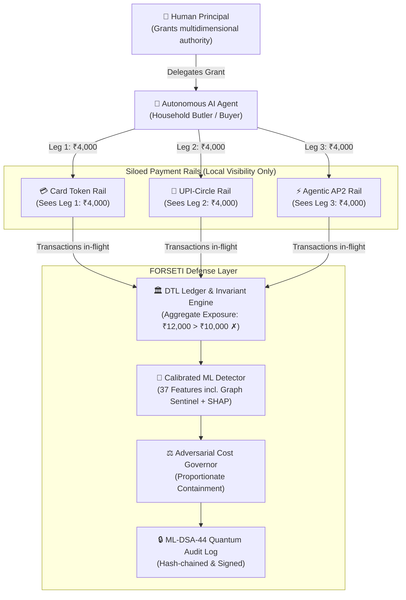

# LEARN_00 — Start Here

> **Prerequisites:** None. This is the entry point to the entire FORSETI curriculum.  
> **You will be able to:**
> - Understand the purpose, structure, and reading paths of this 22-chapter course.
> - Deliver the 60-second elevator pitch explaining what FORSETI is and why it exists.
> - Navigate between the conceptual, mathematical, architectural, and operational layers of the codebase.
> - Know the source of truth hierarchy and how to verify claims directly against code and artifacts.  
> **Files this chapter is about:** `README.md`, `tasks.py`, `Makefile`, `backend/app/main.py`

---

## 1. Welcome to FORSETI

🧒 **Like you're five**  
Imagine you give your smart toy robot ₹100 of pocket money to buy school supplies. You give it three separate wallets: one for the card shop, one for phone payments, and one for online orders. Each wallet has a ₹100 safety rule. If the robot spends ₹40 from the first wallet, ₹40 from the second, and ₹40 from the third, every wallet thinks everything is fine. But the robot spent ₹120 of your ₹100! FORSETI is the master guardian sitting above all three wallets, keeping track of the real total and making sure the robot only buys what you allowed.

🏪 **In real life**  
An autonomous household procurement agent is granted a monthly budget of ₹10,000 to purchase groceries. It has access to a tokenized credit card, a UPI-Circle delegation, and an agentic web mandate. An adversary exploits the agent to make three concurrent ₹4,000 purchases across the three distinct rails. Each rail approves its leg because ₹4,000 is under the individual rail cap. Without cross-rail state, the user suffers an unchecked ₹2,000 budget breach (total spend ₹12,000). FORSETI provides the cross-rail delegation-trust ledger that catches and stops this cross-rail split.

🎓 **Properly**  
FORSETI is a hybrid security framework for autonomous agentic commerce. It bridges the structural blind spot of modern payment architectures where authorization is siloed per [payment rail](LEARN_13_GLOSSARY.md#payment-rail). By introducing a **[Delegation-Trust Ledger (DTL)](LEARN_13_GLOSSARY.md#delegation-trust-ledger-dtl)** (`backend/app/dtl/ledger.py:7`), FORSETI deterministically tracks multidimensional authority across seven core dimensions ([AMOUNT](LEARN_13_GLOSSARY.md#authority-dimensions), [PER_TX](LEARN_13_GLOSSARY.md#authority-dimensions), [RAIL](LEARN_13_GLOSSARY.md#authority-dimensions), [MERCHANT](LEARN_13_GLOSSARY.md#authority-dimensions), [PURPOSE](LEARN_13_GLOSSARY.md#authority-dimensions), [TIME](LEARN_13_GLOSSARY.md#authority-dimensions), and [BENEFICIARY](LEARN_16_INTENT_FIREWALL.md) — the seventh dimension added by the Agentic Payment Security Runtime expansion, LEARN_16) and couples deterministic invariant enforcement with an explainable Gradient-Boosted Decision Tree (GBDT) machine learning detector (`backend/app/detector/model.py:54`), post-quantum cryptographic auditing (`backend/app/crypto/pqc_provider.py:2`), and — since the expansion — an Agent Intent Firewall, Deception Lab, Kill Chain scoring, Graph Sentinel ML features, and an Adaptive Immune escalation system (LEARN_16–20).



---

## 2. The 60-Second Elevator Pitch

> "When humans delegate financial authority to AI agents, existing payment rails face an architectural blind spot: **each rail only evaluates its own transactions in isolation**. An agent with a ₹10,000 grocery allowance can execute ₹4,000 on a credit card, ₹4,000 on UPI, and ₹4,000 on an agentic mandate. Every rail approves locally, but the human's total budget is breached by ₹2,000. 
> 
> FORSETI solves this by introducing the **Delegation-Trust Ledger (DTL)**. It evaluates every transaction against **seven** deterministic invariants — amount, per-transaction limit, permitted rails, merchant category, beneficiary, semantic basket intent, and validity window — plus an eighth check for a suspended mandate.
>
> Here is the measured result, and the interesting part is the comparison rather than any one number. With the cross-rail attack family **withheld from training**, a model that cannot see across rails reaches **0.172** recall on it. Give the same model DTL aggregate features and it reaches **0.828**. The deterministic invariant reaches **0.844** — and **0.844 again** with the family in training, because it is arithmetic over the grant and has no fitted parameter that training data could move. That equality is an identity, not a lucky run (`artifacts/evaluation/baselines.json`).
>
> We do not claim the classifier generalises: 0.828 against 0.844 is inside the 95% interval at n=64, and we say so rather than round it up. Paired with a calibrated GBDT, an adversarial cost governor, a synthetic scoped-token lifecycle, an advisory 12-agent AI layer, and NIST FIPS 204 post-quantum audit signatures, FORSETI is a research prototype for keeping delegated authority enforceable across rails."

---

## 3. Curriculum Map & Recommended Reading Paths

This 22-chapter course is organized into six progressive tracks:

```
┌────────────────────────────────────────────────────────────────────────┐
│                        Track 1: Foundations                            │
│  [00: Start Here] ──► [01: What & Why] ──► [02: Tech Stack] ──► [03: Map]
└──────────────────────────────────┬─────────────────────────────────────┘
                                   ▼
┌────────────────────────────────────────────────────────────────────────┐
│                    Track 2: Core Defense Engines                       │
│  [04: DTL Core] ────────► [05: Attacks & Simulator] ──► [06: ML Model]  │
└──────────────────────────────────┬─────────────────────────────────────┘
                                   ▼
┌────────────────────────────────────────────────────────────────────────┐
│                   Track 3: System Infrastructure                       │
│  [07: Arena & Events] ──► [08: Crypto Audit] ──► [09: AI Agents]       │
└──────────────────────────────────┬─────────────────────────────────────┘
                                   ▼
┌────────────────────────────────────────────────────────────────────────┐
│                  Track 4: Verification & Operations                    │
│  [10: Frontend] ──► [11: Pipelines & Artifacts] ──► [12: Tests & Verify]
└──────────────────────────────────┬─────────────────────────────────────┘
                                   ▼
┌────────────────────────────────────────────────────────────────────────┐
│                    Track 5: Mastery & Defense                          │
│  [13: Glossary] ──► [14: Teach It Back] ──► [15: Gaps & Drift]         │
└──────────────────────────────────┬─────────────────────────────────────┘
                                   ▼
┌────────────────────────────────────────────────────────────────────────┐
│           Track 6: Agentic Payment Security Runtime Expansion          │
│  [16: Intent Firewall] ──► [17: Deception Lab] ──► [18: Kill Chain]    │
│  ──► [19: Graph Sentinel] ──► [20: Adaptive Immune & Risk Engine]      │
│  ──► [21: Tokenization]                                                │
└────────────────────────────────────────────────────────────────────────┘
```

### Reading Tracks by Role

| Target Audience | Primary Focus Chapters | Objective |
|---|---|---|
| **Executive / Judge** | `00`, `01`, `04`, `14`, `15`, `20` | Master the core value proposition, key headline findings, and defense against tough questions in under 15 minutes. |
| **Security Engineer** | `04`, `05`, `07`, `08`, `12`, `16`, `17` | Deep-dive into invariant mathematics, attack vectors, hash chains, ML-DSA-44 PQC verification, the 7th authority dimension, and agent-reasoning attacks. |
| **ML / Data Scientist** | `05`, `06`, `11`, `12`, `19` | Inspect the 37-feature schema across 6 groups, zero train-serving skew design, GBDT calibration, baselines, ablation results, and the graph-feature leakage case study. |
| **Full-Stack Developer** | `02`, `03`, `07`, `09`, `10` | Trace the FastAPI backend, WebSocket state replication, Next.js UI components, and the 12 AI advisory agents. |
| **Adaptive Systems / Red-Blue** | `05`, `18`, `20` | Understand the 11-stage kill chain, the closed Red/Blue adaptive loop, and the Blue-side escalation ladder. |
| **Tokenization / GFF Pillars** | `04`, `16`, `21` | See how authority, intent-security, and scoped-token credentials fit together as one runtime, not three unrelated products. |

---

## 4. Course Index

| # | Chapter | Key Topic Covered | Primary Files |
|---|---|---|---|
| **00** | [Start Here](LEARN_00_START_HERE.md) | Course index, 60-second pitch, navigation, learning outcomes | `README.md`, `tasks.py` |
| **01** | [What & Why](LEARN_01_WHAT_AND_WHY.md) | The payment stack, delegation, the cross-rail blind spot, core claims | `docs/RESPONSIBLE_RESEARCH.md` |
| **02** | [Tech Stack](LEARN_02_TECH_STACK.md) | Python, FastAPI, XGBoost, Next.js 16, dilithium-py, and 3-tier fallbacks | `backend/requirements.txt`, `frontend/package.json` |
| **03** | [Codebase Map](LEARN_03_MAP_OF_THE_CODEBASE.md) | 89 files catalogued: line counts, purposes, "what breaks if deleted" | `backend/app/**`, `frontend/app/**` |
| **04** | [The DTL Core](LEARN_04_THE_DTL_CORE.md) | Seven invariants, worked arithmetic, ledger balance tracking, cost governor | `dtl/ledger.py`, `dtl/invariant_engine.py` |
| **05** | [Attacks & Simulator](LEARN_05_ATTACKS_AND_SIMULATOR.md) | 3 rail adapters, 17 executable vectors, 63-vector taxonomy parser | `simulator/`, `redteam/`, `taxonomy.py` |
| **06** | [The ML Model](LEARN_06_THE_ML_MODEL.md) | 37 features / 6 groups, anti-circularity dataset, calibration, SHAP, negative result | `detector/feature_schema.py`, `detector/train.py` |
| **07** | [Arena & Events](LEARN_07_ARENA_AND_EVENTS.md) | Battle orchestrator, 26 event types, SHA-256 hash chaining, WebSockets | `arena/orchestrator.py`, `arena/events.py` |
| **08** | [Crypto Audit](LEARN_08_CRYPTO_AUDIT.md) | ML-DSA-44 post-quantum signatures, canonical JSON, 4 tamper tests | `crypto/pqc_provider.py`, `crypto/mldsa_audit.py` |
| **09** | [AI Agent Layer](LEARN_09_AI_AGENT_LAYER.md) | 12 advisory AI agents, provider fallback chain, rule that LLMs never enforce | `ai/llm_client.py`, `ai/agents.py`, `ai/routes.py` |
| **10** | [Frontend](LEARN_10_FRONTEND.md) | Next.js App Router, ArenaProvider, SVG canvas, 16 dashboard pages | `frontend/app/lib/ArenaProvider.tsx`, `components/` |
| **11** | [Pipelines & Artifacts](LEARN_11_PIPELINES_AND_ARTIFACTS.md) | `tasks.py` targets, experiment runner, artifact JSONs, measured metrics | `experiment_runner.py`, `artifacts/**` |
| **12** | [Tests & Verification](LEARN_12_TESTS_AND_VERIFY.md) | 455-test pytest suite, test classifications, reproducing headline numbers | `backend/tests/` |
| **13** | [Glossary](LEARN_13_GLOSSARY.md) | Comprehensive dictionary of domain terms (ELI5, precise definition, code citation) | System-wide terminology |
| **14** | [Teach It Back](LEARN_14_TEACH_IT_BACK.md) | Speaking scripts (60s, 5m, 20m), demo walkthrough, hostile Q&A bank, quiz | Comprehensive oral defense |
| **15** | [Gaps & Discrepancies](LEARN_15_KNOWN_GAPS_AND_DISCREPANCIES.md) | Verified doc↔code drift ledger, vestigial files, simulation boundaries | Integrity audit |
| **16** | [Intent Firewall](LEARN_16_INTENT_FIREWALL.md) | The 7th authority dimension (BENEFICIARY), `INV_07`, the drift-vector reshaping layer | `models/state.py`, `intent_firewall/` |
| **17** | [Deception Lab](LEARN_17_DECEPTION_LAB.md) | 4 detectors for attacks on the agent's own reasoning, orthogonal to authority enforcement | `deception_lab/` |
| **18** | [Kill Chain](LEARN_18_KILL_CHAIN.md) | 11-stage lifecycle taxonomy, per-round scoring, session-level coverage | `kill_chain/` |
| **19** | [Graph Sentinel](LEARN_19_GRAPH_SENTINEL.md) | Cross-authority entity graph, 37-feature schema, the merchant-leakage case study | `graph_sentinel/`, `detector/feature_schema.py` |
| **20** | [Adaptive Immune & Risk Engine](LEARN_20_ADAPTIVE_IMMUNE_SYSTEM.md) | Blue-side escalation ladder, the campaign runner, the Unified Risk Engine composite | `feedback/policy_adapter.py`, `risk_engine/` |
| **21** | [Tokenization](LEARN_21_TOKENIZATION.md) | Synthetic scoped-token lifecycle, Settlement Conflict & Reconciliation Drift (Kill Chain stages 10-11) | `tokenization/`, `settlement/` |
| **22** | [The Leak](LEARN_22_THE_LEAK.md) | **Read this one.** How our own generator handed the classifier a shortcut, how it became the headline, and the sequel where we fixed the number and then over-read it | `detector/leakage_audit.py`, `detector/baselines.py` |

---

## 5. Ground-Truth Verification Policy

Every fact in this course is held to strict provenance standards:

1. **Source of Truth Ranking:**
   - Rank 1: Source code in `backend/app/**` and `frontend/app/**`.
   - Rank 2: Measured run outputs in `artifacts/**`.
   - Rank 3: Test assertions in `backend/tests/**`.
   - Rank 4: Prose documentation (`README.md`, `docs/**`).
2. **Claim Discipline Labels:**
   - **MEASURED**: Quantified output generated by executing a pipeline in this repository.
   - **IMPLEMENTED**: Fully functional code, but not a statistical benchmark claim.
   - **SIMULATED**: Synthetic, standards-inspired simulation; not connected to a live banking rail.
   - **RESEARCH-ONLY**: Catalogued in the taxonomy or literature, deliberately unexecuted.
   - **NOT RUN**: Requires proprietary external datasets (e.g. licensed PaySim/ULB anchors).

---

## Check yourself

1. **What is the central problem FORSETI solves?**
2. **Why does a per-rail limit check fail to prevent cross-rail budget overspending?**
3. **What is the source-of-truth ranking when documentation conflicts with source code?**
4. **Name the three primary layers in the FORSETI defense architecture.**
5. **Where are all experimental measurements stored in the repository?**

<details>
<summary>Answers</summary>

1. FORSETI solves the cross-rail blind spot in delegated agentic commerce where autonomous agents can breach global authority limits by splitting transactions across multiple payment rails that do not communicate with each other.
2. Because each rail adapter only enforces its own local limit against local spend history, lacking any visibility into transactions occurring concurrently on other rails.
3. Source code (`backend/app/**`, `frontend/app/**`) ranks highest, followed by generated artifacts (`artifacts/**`), test suites (`backend/tests/**`), and finally prose markdown documentation.
4. (1) Deterministic Delegation-Trust Ledger & Invariant Engine, (2) Calibrated GBDT Machine Learning Detector with SHAP, and (3) Adversarial Cost Governor with Post-Quantum Audit Logging.
5. In the `artifacts/` directory (`artifacts/evaluation/`, `artifacts/models/`, `artifacts/benchmark/`, `artifacts/fidelity/`, `artifacts/events/`, and `artifacts/final_report.json`).
</details>

---

## Where to go next
→ [LEARN_01 — What and Why](LEARN_01_WHAT_AND_WHY.md)
