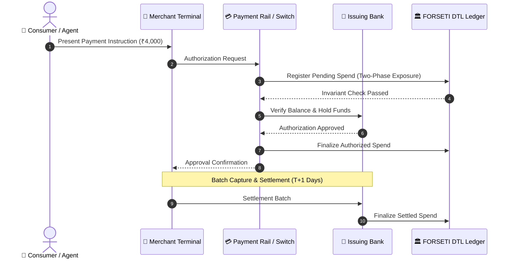

# LEARN_01 — What and Why

> **Prerequisites:** [LEARN_00](LEARN_00_START_HERE.md)  
> **You will be able to:**
> - Explain the end-to-end lifecycle of digital payments from authorization to settlement.
> - Identify the architectural boundaries and local security guards of card tokenization, UPI-Circle, and agentic protocols.
> - Articulate the core security difference between human-in-the-loop checkout and autonomous delegated spending.
> - Detail the cross-rail blind spot with concrete financial mathematics.
> - Differentiate what FORSETI claims and measures from what is explicitly out of scope.  
> **Files this chapter is about:** `docs/RESPONSIBLE_RESEARCH.md`, `backend/app/models/state.py`, `backend/app/simulator/adapters/base.py`

---

## 1. How Money Actually Moves

🧒 **Like you're five**  
When you buy an ice cream at the shop, you don't instantly hand coins to the ice cream factory. First, the shopkeeper asks your mum if you are allowed to buy it (that is *authorization*). Mum nods yes, and you get the ice cream. Later that evening, the shopkeeper adds up all the bills from the day (that is *capture*). At night, the bank moves the actual money from Mum's bank account to the shop's bank account (that is *settlement*).

🏪 **In real life**  
When a consumer taps a card for ₹2,500 at a supermarket, the transaction is not instantly final:
1. **Authorization (0–2 seconds):** The point-of-sale terminal contacts the merchant acquirer, the card network (Visa/Mastercard), and the issuing bank. The issuing bank verifies available credit and places an authorization hold of ₹2,500 on the account (`backend/app/models/state.py:57`).
2. **Capture (end of day):** The merchant submits the batch of authorized transactions to their acquirer for processing.
3. **Settlement (T+1 to T+2 days):** Interbank clearing networks (such as RBI's NEFT/RTGS or card clearinghouses) debit the issuer and credit the acquirer's settlement account (`backend/app/models/state.py:56`).

🎓 **Properly**  
Modern payment architectures split transaction processing into distinct temporal phases to decouple sub-second authorization latency from the operational overhead of batch settlement. In the codebase, this is modeled via the `TransactionState` enumeration (`backend/app/models/state.py:11`):

```python
# backend/app/models/state.py:11
class TransactionState(str, Enum):
    INITIATED = "INITIATED"
    AUTHORIZED = "AUTHORIZED"
    CAPTURED = "CAPTURED"
    SETTLED = "SETTLED"
    FAILED = "FAILED"
    QUARANTINED = "QUARANTINED"
    SHADOW_EXECUTED = "SHADOW_EXECUTED"
```

Because authorization holds money *in flight* before settlement completes, any system attempting to enforce a financial ceiling must track both settled funds and pending/authorized funds simultaneously.



---

## 2. Payment Rails and Their Local Guards

🧒 **Like you're five**  
Think of payment rails as three different toll roads leading into the same city:
- The **Card Highway** checks your card number and expiration date.
- The **UPI Road** asks for your special 6-digit phone PIN.
- The **Robot Delivery Lane** checks your digital machine pass.

Each toll booth only counts the cars driving on its own road. The guard on the Card Highway has no idea how many cars just zoomed through the UPI Road!

🏪 **In real life**  
In India and global markets, consumers hold multiple payment instruments linked to the same underlying bank balance or household budget:
1. **Card Tokenization (EMV / MDES / VTS):** Replaces a 16-digit primary account number with a surrogate token locked to a device or merchant. The card rail guard checks the token's cryptographic cryptogram, merchant category code (MCC), and local credit limit (`backend/app/simulator/adapters/card_adapter.py:22`).
2. **UPI-Circle (NPCI OC 201-B):** Allows a primary account holder to delegate a secondary user or child wallet with a dedicated monthly spend cap (e.g. ₹10,000) authenticated via delegated UPI handles (`backend/app/simulator/adapters/upi_adapter.py:20`).
3. **Agentic Mandates (Google AP2 / W3C Web Payments):** Cryptographically binds autonomous buyer intents to machine-generated cart manifests via digital signature chains (`backend/app/simulator/adapters/agentic_adapter.py:22`).

🎓 **Properly**  
Every payment rail operates an isolated authorization stack. In FORSETI's simulation harness, each rail is represented by an adapter inheriting from `BaseRailAdapter` (`backend/app/simulator/adapters/base.py:11`):

```python
# backend/app/simulator/adapters/base.py:11
class BaseRailAdapter(ABC):
    def __init__(self, rail_type: PaymentRailType, local_limit: float = 10000.0):
        self.rail_type = rail_type
        self.local_limit = local_limit
        self.local_spent = 0.0
        self.authorized_txs: List[SyntheticTransaction] = []

    def validate_and_authorize_local(self, tx: SyntheticTransaction) -> Tuple[bool, str]:
        # Evaluates ONLY local limits and local rail attributes
        ...
```

Each rail maintains its own `local_spent` counter. The Card adapter (`card_adapter.py:22`) enforces its allowlist of approved MCCs (`{"5411", "5499", "4900", "5311"}`) and its ₹10,000 local cycle cap. The UPI adapter (`upi_adapter.py:20`) verifies delegated caps. The Agentic adapter (`agentic_adapter.py:22`) validates cart item hashes. **None of these adapters communicate with each other.**

---

## 3. What Delegation Really Means

🧒 **Like you're five**  
When Mum gives you ₹500 and says *"Buy milk and bread, and nothing else"*, she gave you **permission** (delegation). But if you take that ₹500 and buy ₹500 worth of video game coins, you spent the right *amount* of money, but you broke the *promise* of what the money was for. 

🏪 **In real life**  
A homeowner delegates their smart home assistant to manage grocery restocking:
- **Human instruction:** *"Keep the fridge stocked with essentials. Spend up to ₹10,000 this week on groceries."*
- **Siloed banking view:** The bank sets a ₹10,000 credit limit on the assistant's virtual card.
- **The failure mode:** The assistant is compromised by a prompt injection attack or rogue vendor. It purchases ₹9,500 worth of Amazon Gift Cards at a supermarket (MCC 5411). The bank sees a ₹9,500 transaction at a registered grocery store and approves it. The human's intent (consumables) was converted into untraceable liquid cash.

🎓 **Properly**  
Delegation in distributed systems is the granting of authority by a **[Principal](LEARN_13_GLOSSARY.md#principal)** to an **[Agent](LEARN_13_GLOSSARY.md#autonomous-agent)** to act on the principal's behalf within bounded constraints. 

In traditional finance, delegation is **unidimensional**: authority is collapsed into a single scalar number (the credit/debit limit) and an optional merchant category filter. In autonomous agentic systems, authority is inherently **multidimensional** (`backend/app/models/state.py:29`). A valid delegation specification comprises six orthogonal dimensions:

```
                      ┌────────────────────────────────────────┐
                      │    MULTIDIMENSIONAL AUTHORITY GRANT    │
                      └───────────────────┬────────────────────┘
                                          │
         ┌───────────────┬────────────────┼───────────────┬───────────────┐
         ▼               ▼                ▼               ▼               ▼
    [ AMOUNT ]      [ PER_TX ]        [ RAIL ]      [ MERCHANT ]     [ PURPOSE ]
    Ceiling:        Single Cap:       Permitted:    Allowed MCCs:    Exclusions:
    ₹10,000.00      ₹3,000.00         CARD, UPI     5411, 5499       STORED_VALUE
                                          │
                                          ▼
                                      [ TIME ]
                                  Window: 168 Hours
```

1. **[AMOUNT](LEARN_13_GLOSSARY.md#authority-dimensions):** Global aggregate spend across all rails (`global_budget_ceiling`).
2. **[PER_TX](LEARN_13_GLOSSARY.md#authority-dimensions):** Maximum value permissible for a single autonomous transaction without human step-up confirmation (`per_transaction_cap`).
3. **[RAIL](LEARN_13_GLOSSARY.md#authority-dimensions):** Set of payment channels authorized for use (`permitted_rails`).
4. **[MERCHANT](LEARN_13_GLOSSARY.md#authority-dimensions):** Permitted merchant category codes (`permitted_mccs`).
5. **[PURPOSE](LEARN_13_GLOSSARY.md#authority-dimensions):** Semantic classification and prohibited item categories (`semantic_exclusions`, e.g. gift cards, crypto tokens).
6. **[TIME](LEARN_13_GLOSSARY.md#authority-dimensions):** Validity lifespan of the delegated mandate (`validity_window_hours`).

---

## 4. Why Agentic Payments Break Existing Defenses

Existing fraud detection systems (like FICO Falcon, Visa Advanced Authorization, or Mastercard Decision Intelligence) were built around **human behavioral biometrics**:
- Keystroke dynamics and mouse movements on checkout pages.
- Device fingerprinting (IP address, canvas hash, browser user-agent).
- Velocity anomalies relative to human physical limitations (e.g. human shopping speed).

Autonomous AI agents break all of these assumptions:
1. **Machine Velocity:** An agent can evaluate 50 online merchants, construct baskets, and dispatch payment instructions across three payment rails within 400 milliseconds.
2. **Autonomous Decoupling:** The human principal is completely out of the real-time loop. There is no one looking at their phone screen to spot an anomaly before clicking "Pay".
3. **Legitimate Sub-Delegation:** A primary agent (e.g. Household Manager) can spawn temporary sub-agents (e.g. Grocery Buyer, Laundry Booker), fanning out delegated authority without centralized tracking.

---

## 5. The Cross-Rail Blind Spot

🧒 **Like you're five**  
You have ₹10 in your left pocket, ₹10 in your middle pocket, and ₹10 in your right pocket. Mum says: *"You can spend at most ₹10 today total."*  
You go to Shop A and spend ₹4 from your left pocket. Left pocket says: *"₹4 is less than ₹10! Approved."*  
You go to Shop B and spend ₹4 from your middle pocket. Middle pocket says: *"₹4 is less than ₹10! Approved."*  
You go to Shop C and spend ₹4 from your right pocket. Right pocket says: *"₹4 is less than ₹10! Approved."*  
Every pocket was happy, but you spent ₹12! You broke Mum's rule by ₹2 because none of the pockets knew what the other pockets were doing.

🏪 **In real life**  
Consider a household budget of ₹10,000 granted to an autonomous purchasing agent. The agent is provisioned across three rails, each configured with a default local safety ceiling of ₹10,000:

| Step | Rail Used | Transaction Amount | Local Rail Limit | Local Rail Spent | Local Decision | Global True Spend | Over-budget? |
|---|---|---|---|---|---|---|---|
| **Leg 1** | Card Token | ₹4,000.00 | ₹10,000.00 | ₹4,000.00 | **APPROVED ✓** | ₹4,000.00 | No |
| **Leg 2** | UPI-Circle | ₹4,000.00 | ₹10,000.00 | ₹4,000.00 | **APPROVED ✓** | ₹8,000.00 | No |
| **Leg 3** | Agentic AP2 | ₹4,000.00 | ₹10,000.00 | ₹4,000.00 | **APPROVED ✓** | ₹12,000.00 | **YES (+₹2,000)** |

Every single rail's local rules engine evaluated its transaction as 100% compliant. Yet the user lost ₹2,000 in excess spending because no entity computed the sum across rails.

🎓 **Properly**  
Mathematically, let $R = \{r_1, r_2, \dots, r_k\}$ be the set of available payment rails. Each rail $r_i$ maintains an internal spend register $S(r_i)$ and evaluates transaction $tx_j$ with amount $a_j$ against its local limit $L(r_i)$:

$$\text{Rail Decision}(r_i, tx_j) = \begin{cases} \text{APPROVE}, & \text{if } S(r_i) + a_j \le L(r_i) \\ \text{DECLINE}, & \text{otherwise} \end{cases}$$

When a human delegates a global budget ceiling $C_{\text{global}}$, safety requires that across all rails:

$$\sum_{i=1}^k S(r_i) + a_j \le C_{\text{global}}$$

Under siloed rails, $L(r_i) = C_{\text{global}}$ for all $i$. An adversary generates $k$ transactions such that $\forall i, a_i \le L(r_i)$, but $\sum_{i=1}^k a_i = k \cdot a_i > C_{\text{global}}$. Because no rail computes $\sum S(r_i)$, cross-rail overspending succeeds with 100% probability across traditional rails.

---

## 6. What FORSETI Claims (and What It Does Not)

To maintain absolute scientific credibility, FORSETI establishes a strict claim boundary (`docs/RESPONSIBLE_RESEARCH.md`):

```
┌────────────────────────────────────────────────────────────────────────┐
│                        WHAT FORSETI CLAIMS                             │
├────────────────────────────────────────────────────────────────────────┤
│ ✓ Deterministic cross-rail state tracking via DTL (Ledger + 7 Invariants)│
│ ✓ Zero train/serve feature skew (identical code in training and inference)│
│ ✓ Cross-rail holdout: a model with NO aggregate view reaches 0.172;    │
│   with DTL features 0.828; the invariant 0.844, holdout-independent.   │
│ ✓ Inline latency p99 of 0.8791 ms (< 30.0 ms budget over 10,000 txs).   │
│ ✓ NIST FIPS 204 ML-DSA-44 post-quantum audit log signatures.           │
└────────────────────────────────────────────────────────────────────────┘

┌────────────────────────────────────────────────────────────────────────┐
│                    WHAT FORSETI EXPLICITLY DOES NOT CLAIM              │
├────────────────────────────────────────────────────────────────────────┤
│ ✗ No real-world production banking connectivity (all rails synthetic). │
│ ✗ No claim of production HSM key management (dev keys seeded for demo).│
│ ✗ No claim that synthetic fraud matches real-world production fraud    │
│   distribution (anchor validation pipeline is honestly marked NOT RUN) │
│ ✗ No claim that the 12 AI agents enforce authorization decisions       │
│   (AI is strictly advisory; deterministic DTL makes all auth decisions)│
└────────────────────────────────────────────────────────────────────────┘
```

---

## Check yourself

1. **What are the three temporal phases of a payment transaction?**
2. **Why does each payment rail approve its leg during a cross-rail split attack?**
3. **Name the seven dimensions of delegated authority defined in FORSETI.**
4. **Why do behavioral biometrics (like mouse speed) fail for AI agents?**
5. **Does the AI agent layer in FORSETI make authorization decisions?**

<details>
<summary>Answers</summary>

1. Authorization (verifying limit and holding funds), Capture (merchant batch submission), and Settlement (interbank transfer of actual funds).
2. Because each rail adapter only checks its own local spend register ($S(r_i) + a_j \le L(r_i)$) and cannot see spend occurring on other rails.
3. AMOUNT (global budget ceiling), PER_TX (single transaction cap), RAIL (permitted payment rails), MERCHANT (merchant MCC allowlist), PURPOSE (semantic cart items/exclusions), TIME (delegation validity window), and BENEFICIARY (permitted settlement counterparties — the 7th dimension, added by the Agentic Security Runtime expansion; see LEARN_16).
4. Because autonomous AI agents operate via machine-to-machine API calls at microsecond speeds with no human present on the checkout page.
5. No. The AI agent layer is strictly advisory. All authorization and containment decisions are made deterministically by the DTL Ledger and Invariant Engine (`backend/app/ai/agents.py:7`).
</details>

---

## Where to go next
→ [LEARN_02 — Tech Stack](LEARN_02_TECH_STACK.md)
