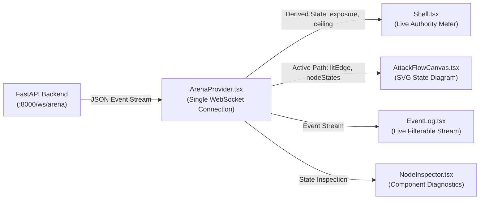

# LEARN_02: Tech Stack

> **Prerequisites:** [LEARN_01](LEARN_01_WHAT_AND_WHY.md)  
> **You will be able to:**
> - Explain the role, architectural rationale, and failure modes of every backend and frontend dependency.
> - Trace FORSETI's signature three-tier graceful fallback pattern across ML backends, explainability engines, and cryptographic providers.
> - Understand the Next.js 16 App Router frontend architecture and its integration with the backend WebSocket stream.
> - Articulate why certain heavyweight enterprise dependencies (databases, message brokers) were intentionally omitted.  
> **Files this chapter is about:** `backend/requirements.txt`, `frontend/package.json`, `backend/app/detector/model.py`, `backend/app/detector/explainability.py`, `backend/app/crypto/pqc_provider.py`

---

## 1. Backend Technology Stack (Python 3.14)

The backend is built in Python to combine high-speed asynchronous web handling with the scientific Python data science and machine learning ecosystem.

```
┌────────────────────────────────────────────────────────────────────────┐
│                          FASTAPI / UVICORN                             │
│                  Asynchronous REST Endpoints + WebSockets              │
└──────────────────────────────────┬─────────────────────────────────────┘
                                   │
         ┌─────────────────────────┼─────────────────────────┐
         ▼                         ▼                         ▼
   [ DATA / MODEL ]        [ SECURITY / CORE ]       [ SCIENTIFIC / ML ]
   • Pydantic v2            • Dilithium-py (PQC)     • XGBoost / LightGBM
   • NumPy / Pandas         • SHA-256 Hash Chain      • SHAP (TreeExplainer)
   • Joblib                 • Python stdlib hashlib   • Scikit-learn / Scipy
```

### Dependency Deep-Dive

| Package | Declared Version | Primary Purpose | Key Location | Fallback Mechanism |
|---|---|---|---|---|
| `fastapi` | $\ge 0.110$ | Async REST API & OpenAPI schema generation | `backend/app/main.py:1` | None (core web framework) |
| `uvicorn` | $\ge 0.28$ | ASGI production web server | `tasks.py:51` | Standard ASGI server |
| `pydantic` | $\ge 2.6$ | Strict data schema validation & serialization | `backend/app/models/state.py:3` | None (data layer foundation) |
| `websockets` | $\ge 12.0$ | Real-time event streaming to the dashboard | `backend/app/main.py:377` | Polling via `GET /api/arena/events` |
| `numpy` | $\ge 1.26$ | High-performance vectorized numerical operations | `backend/app/detector/feature_schema.py:2` | None (fundamental array backend) |
| `pandas` | $\ge 2.0$ | Tabular dataset management and temporal sorting | `backend/app/detector/dataset_builder.py:253` | NumPy array manipulation |
| `scikit-learn` | $\ge 1.4$ | Metrics (PR-AUC, ROC-AUC), isotonic calibration, GBDT fallback | `backend/app/detector/calibration.py:48` | `HistGradientBoostingClassifier` |
| `xgboost` | $\ge 2.0$ | **Preferred model.** Fast GBDT on tabular imbalanced data | `backend/app/detector/model.py:54` | Falls back to LightGBM |
| `lightgbm` | $\ge 4.0$ | First fallback gradient booster | `backend/app/detector/model.py:73` | Falls back to `sklearn_hgb` |
| `shap` | $\ge 0.44$ | Exact Shapley feature attribution | `backend/app/detector/explainability.py:43` | `model_feature_contribution` |
| `dilithium-py`| $\ge 1.0$ | Pure-Python NIST FIPS 204 ML-DSA-44 post-quantum signatures | `backend/app/crypto/pqc_provider.py:55` | Raises `PQCUnavailableError` |
| `networkx` | $\ge 3.0$ | Payment Graph Sentinel: PageRank, betweenness, Louvain community detection | `backend/app/graph_sentinel/graph_builder.py` | None (no fallback; graph_* features default to 0.0 if absent, see [LEARN_19](LEARN_19_GRAPH_SENTINEL.md)) |
| `scipy` | $\ge 1.11$ | Kolmogorov-Smirnov & Jensen-Shannon statistical tests | `backend/app/fidelity/ks_test.py:11` | None (fidelity analysis) |
| `matplotlib` | $\ge 3.8$ | Headless figure rendering (PR/ROC curves) | `backend/app/detector/train.py:270` | Text/JSON metric exports |
| `joblib` | $\ge 1.3$ | Atomic serialization of pipeline models and calibrators | `backend/app/detector/train.py:247` | JSON weights representation |
| `pytest` | $\ge 8.0$ | Automated test suite runner (455 tests) | `backend/tests/` | Built-in `unittest` runner |

---

## 2. The Three Architectural Fallback Patterns

A signature design principle in FORSETI is that **every subsystem degrades gracefully and reports its exact execution backend honestly**. No component ever fakes a result or mislabels a fallback.

```
┌────────────────────────────────────────────────────────────────────────┐
│                 FORSETI THREE-TIER FALLBACK ARCHITECTURE               │
├────────────────────────────────────────────────────────────────────────┤
│ 1. MODEL ENGINE:                                                       │
│    [Tier 1: XGBoost] ──► [Tier 2: LightGBM] ──► [Tier 3: Sklearn HGB]  │
│    (Recorded in artifacts/evaluation/metrics.json -> environment)      │
│                                                                        │
│ 2. EXPLAINABILITY ENGINE:                                              │
│    [Tier 1: shap.TreeExplainer] ──► [Tier 2: model_feature_contribution]│
│    (Never mislabelled as SHAP; reported in API as method name)         │
│                                                                        │
│ 3. POST-QUANTUM CRYPTOGRAPHY:                                          │
│    [Tier 1: liboqs (C)] ──► [Tier 2: dilithium-py] ──► [Tier 3: REFUSE]│
│    (Raises PQCUnavailableError; never produces fake "VERIFIED" claims) │
└────────────────────────────────────────────────────────────────────────┘
```

### Pattern 1: Machine Learning Model Backend

🧒 **Like you're five**  
When building a treehouse, you prefer using your best power drill (XGBoost). If the battery dies, you use your backup drill (LightGBM). If that breaks too, you use your trusty hand screwdriver (Scikit-learn). The treehouse still gets built, and you write down exactly which tool you used in your diary.

🏪 **In real life**  
Different cloud environments or edge servers may lack pre-compiled C++ binaries or OpenMP support needed for specific GBDT packages. Rather than crashing or failing to start, FORSETI inspects the environment dynamically (`backend/app/detector/model.py:19`):

```python
# backend/app/detector/model.py:19
def resolve_backend() -> Tuple[str, str]:
    """Returns (backend_id, version) for the best available GBDT library."""
    try:
        import xgboost
        return "xgboost", xgboost.__version__
    except Exception:
        pass
    try:
        import lightgbm
        return "lightgbm", lightgbm.__version__
    except Exception:
        pass
    import sklearn
    return "sklearn_hgb", sklearn.__version__
```

The resolved backend is recorded in `artifacts/evaluation/metrics.json` (`environment.package_versions.xgboost = "3.4.1"`).

---

### Pattern 2: Explainability (SHAP vs Feature Contribution)

🧒 **Like you're five**  
If the teacher asks why you gave a student a gold star, you use a special scientific calculator (SHAP) that explains how every single good deed helped. If the calculator runs out of battery, you look at the rulebook points instead (`model_feature_contribution`). But you never tell the teacher you used the scientific calculator when you didn't!

🎓 **Properly**  
SHAP (Shapley Additive Explanations) provides game-theoretic feature attributions with mathematical guarantees of local accuracy and consistency. However, compiling the SHAP C extensions can fail on restricted runtime containers. 

FORSETI initializes `shap.TreeExplainer` when available (`backend/app/detector/explainability.py:43`). If `shap` is missing, it falls back to tree-weight feature contributions (`model_feature_contribution`). **Crucially, the API and UI never label the fallback as SHAP** (`explainability.py:8`):

```python
# backend/app/detector/explainability.py:18
SHAP_METHOD = "shap.TreeExplainer"
FALLBACK_METHOD = "model_feature_contribution"

# The returned explanation object explicitly states:
# { "method": "shap.TreeExplainer" | "model_feature_contribution" }
```

---

### Pattern 3: Post-Quantum Cryptography (PQC Provider)

🧒 **Like you're five**  
You have an unbreakable wax seal from the future (ML-DSA-44 post-quantum signature). If you have the fast metal stamper (`liboqs`), you use it. If not, you use the pure-wood hand carver (`dilithium-py`). But if you have no stamper at all, you **stop and tell everyone the stamper is missing** instead of drawing a fake stamp with a crayon!

🎓 **Properly**  
FORSETI implements genuine lattice-based signatures conforming to NIST FIPS 204 (ML-DSA-44). Many prototypes simulate cryptography by hashing messages or using placeholder strings. FORSETI enforces a strict honesty contract (`backend/app/crypto/pqc_provider.py:6`):

1. **Tier 1:** `liboqs` (C reference implementation, opt-in via `FORSETI_TRY_LIBOQS=1`).
2. **Tier 2:** `dilithium-py` (pure-Python implementation, zero native build requirements).
3. **Tier 3:** If neither is importable or `ENABLE_PQC=0`, the provider **raises `PQCUnavailableError`**. The API reports `PQC MODULE UNAVAILABLE` and never displays a false `VERIFIED` status.

---

## 3. Frontend Technology Stack (Next.js 16 App Router)

The frontend is built in modern React and TypeScript using the Next.js 16 App Router (`frontend/package.json`):

| Package | Version | Architectural Role |
|---|---|---|
| `next` | `16.3.1` | App Router framework: server rendering, file-based routing, static compilation |
| `react` / `react-dom` | `19.2.8` | Component rendering engine and hook-based reactive state |
| `typescript` | `^5.0` | Strict static typing mirroring backend Pydantic models (`frontend/app/lib/types.ts`) |
| `tailwindcss` | `^4.0` | Atomic utility-first CSS styling (`globals.css`) |
| `framer-motion` | `^13.1.0` | High-framerate SVG edge lighting and animated exposure bars |
| `lucide-react` | `^1.31.0` | Standardized iconography across the 16 dashboard pages |
| `canvas-confetti` | `^1.9.4` | Particle celebration effect on successful Blue containment victories |

### The Unified WebSocket Spine (`ArenaProvider.tsx`)

The entire user interface is synchronized with the backend through a single central React Context: `ArenaProvider` (`frontend/app/lib/ArenaProvider.tsx:49`). 



Rather than polling REST endpoints, `ArenaProvider` maintains an auto-reconnecting WebSocket connection (`ws://localhost:8000/ws/arena`). When an arena round executes, every component derives its animated state (e.g. current exposure, active graph edges, violation banners) directly from the received event stream.

---

## 4. What Was Intentionally Omitted (and Why)

Understanding why certain enterprise technologies were **not** used is critical when presenting FORSETI:

1. **No External Database (PostgreSQL/Redis):** All authority state, ledgers, and transaction histories reside in Python in-memory data structures (`backend/app/dtl/ledger.py:14`). This achieves sub-millisecond execution times without external database setup overhead.
2. **No Message Brokers (Kafka/RabbitMQ):** In-memory event dispatching and WebSocket broadcasts eliminate distributed streaming complexity while supporting the required interactive demo throughput.
3. **No Heavyweight Deep Learning Frameworks (PyTorch/TensorFlow):** GBDTs (XGBoost/LightGBM) outperform deep neural networks on tabular financial data with extreme class imbalance ($7.09\%$ fraud), train in $<3$ seconds, and require megabytes of memory instead of gigabytes.

---

## Check yourself

1. **Why is XGBoost preferred over deep neural networks for FORSETI's detection model?**
2. **What happens if `shap` fails to import on a target machine?**
3. **How does `pqc_provider.py` behave if no post-quantum cryptography library is available?**
4. **Which React component manages the WebSocket connection to the backend?**
5. **Why are external databases omitted from the prototype architecture?**

<details>
<summary>Answers</summary>

1. XGBoost handles tabular, mixed-scale, imbalanced data significantly better than deep neural networks, trains in under 3 seconds, and provides millisecond inference latency.
2. The system falls back to `model_feature_contribution` and explicitly names that fallback method in the API payload, never claiming it is SHAP (`backend/app/detector/explainability.py:8`).
3. It sets `AVAILABLE=False` and raises `PQCUnavailableError`, ensuring the system reports `PQC MODULE UNAVAILABLE` rather than generating a fake verification (`backend/app/crypto/pqc_provider.py:8`).
4. `ArenaProvider.tsx` (`frontend/app/lib/ArenaProvider.tsx:49`).
5. To eliminate external operational dependencies and ensure sub-millisecond execution latency during interactive demos and benchmark evaluations.
</details>

---

## Where to go next
→ [LEARN_03. Map of the Codebase](LEARN_03_MAP_OF_THE_CODEBASE.md)
