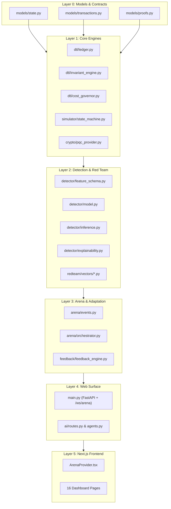

# LEARN_03 — Map of the Codebase

> **Prerequisites:** [LEARN_01](LEARN_01_WHAT_AND_WHY.md), [LEARN_02](LEARN_02_TECH_STACK.md)  
> **You will be able to:**
> - Navigate the entire directory structure of the repository without getting lost.
> - Know the precise purpose of all 89 source files and exactly what breaks if any file is removed.
> - Distinguish active production code from vestigial/historical modules.
> - Trace the structural import dependency graph from base models to the UI.
> - Follow a single transaction step-by-step through every Python function it touches.  
> **Files this chapter is about:** All files in `backend/app/`, `backend/tests/`, and `frontend/app/`

---

## 1. High-Level Repository Architecture

🧒 **Like you're five**  
Think of the entire codebase as a big building with different rooms. Upstairs is the control tower with big glass windows (the frontend dashboard). Downstairs is the engine room with heavy machinery and calculators (the backend Python engines). Outside is the security gate that runs tests every morning (the test runners). Every single file in this building has a specific job, and removing any piece breaks something!

🏪 **In real life**  
When building or auditing a financial defense system, developers must know exactly which module handles data schemas, which handles invariant mathematics, and which serves dashboard pages. If a file is modified or deleted, an engineer must immediately know what downstream dependency will break.

🎓 **Properly**  
The repository is divided into two primary execution tiers: a Python FastAPI backend (`backend/app/**`) and a Next.js TypeScript frontend (`frontend/app/**`), coordinated by automated task runners (`tasks.py`, `Makefile`).

```
Forseti/
├─ tasks.py                  Cross-platform task runner (Windows & POSIX)
├─ Makefile                  POSIX task runner
├─ artifacts/                Measured experimental results & serialized models
├─ backend/                  Python 3.14 + FastAPI backend
│  ├─ app/                   Core application modules
│  └─ tests/                 455-test automated verification suite
├─ frontend/                 Next.js 16 App Router UI dashboard
│  └─ app/                   React components, contexts, and 16 pages
├─ docs/                     Technical documentation and this learning course
└─ scripts/                  Anchor dataset management utilities
```

---

## 2. The Comprehensive File Inventory & "What Breaks If Deleted"

### A. Root Configuration & Orchestration

| File | Lines | Primary Purpose | What breaks if you delete this file? |
|---|---:|---|---|
| `tasks.py` | 78 | Cross-platform task runner | `python tasks.py <target>` commands fail on Windows; developers must type manual Python module invocations. |
| `Makefile` | 62 | POSIX task runner | `make all`, `make test`, and Linux CI pipelines fail. |
| `.env.example` | 24 | Configuration template for environment variables | New developers have no reference for `ENABLE_PQC`, `SEED`, `SAMPLES`, and API key configuration. |
| `scripts/download_anchors.py` | 85 | Anchor dataset downloader guide | `python tasks.py anchors` fails; automated guidance for downloading PaySim/ULB CSVs is lost. |

---

### B. Backend Core & Infrastructure (`backend/app/`)

| File | Lines | Primary Purpose | What breaks if you delete this file? |
|---|---:|---|---|
| `main.py` | 487 | FastAPI app, REST endpoints, and WebSocket server | The entire web server fails to start; no HTTP or WebSocket communication is possible. |
| `paths.py` | 40 | Centralized absolute filesystem path resolution | Modules disagree on the location of `artifacts/`, `docs/`, and `data/`, causing `FileNotFoundError`. |
| `taxonomy.py` | 233 | Parses `docs/taxonomy.md` into structured attack records | `GET /api/attacks` fails; the arena loses metadata mapping for the 55 attack vectors. |
| `demo_runner.py` | 155 | 8-phase scripted console demonstration | `python tasks.py demo` and `POST /api/demo/start` fail to execute the automated walkthrough. |
| `experiment_runner.py` | 190 | Runs all 6 pipeline stages and compiles `final_report.json` | `python tasks.py all` fails; reproducible automated scientific benchmarks cannot be generated. |

---

### C. Data Models (`backend/app/models/`)

| File | Lines | Primary Purpose | What breaks if you delete this file? |
|---|---:|---|---|
| `models/state.py` | 196 | Authority state, payment rails, transaction states, and defense policies | Core data schemas (`DTLGlobalAuthorityState`, `AuthorityDimension`) disappear; the entire backend fails to import. |
| `models/transactions.py` | 53 | Synthetic transaction and shopping cart item schemas | Transaction models (`SyntheticTransaction`, `CartItem`) disappear; simulator and red team cannot construct payloads. |
| `models/proofs.py` | 48 | Machine-checkable invariant violation proof schemas | `SemanticDriftProof` disappears; invariant engine cannot return structured violation evidence. |

---

### D. Delegation-Trust Ledger Core (`backend/app/dtl/`)

| File | Lines | Primary Purpose | What breaks if you delete this file? |
|---|---:|---|---|
| `dtl/ledger.py` | 231 | Global authority ledger, four-bucket exposure, and `try_reserve()` — the atomic check-and-book that replaced a check-then-act race | The system cannot track multi-rail spend exposure; cross-rail split detection breaks completely, and concurrent authorisations can overspend the ceiling. |
| `dtl/invariant_engine.py` | 536 | The 7 deterministic authority invariants plus `INV_08`, the enforced policy state | Invariant checks fail; the system becomes 100% reliant on ML and loses all cross-rail holdout defense. |
| `dtl/cost_governor.py` | 241 | Proportionate containment, with an explicit proof-precedence order | Invariant violations result in total system failure or unhandled exceptions instead of graceful partial auth. |
| `dtl/sku_catalogue.py` | 149 | Attested SKU catalogue — decides what a line item *is*, independently of what the merchant calls it | `INV_02` falls back to trusting merchant free text, and renaming a gift card evades the purpose check. |
| `dtl/beneficiary_directory.py` | 244 | Attested biller directory — the lookup a substitution attack actually poisons | `BENEFICIARY_DRIFT` reverts to a hardcoded VPA with no modelled mechanism. |
| `dtl/delegation_chain.py` | 348 | Sub-delegation links with monotonic narrowing and attestation digests | An agent can grant authority it does not hold, and forged links are indistinguishable from issued ones. |
| `dtl/feature_factory.py` | 68 | *Vestigial 13-feature extractor (unused)* | Nothing breaks (vestigial). |

---

### E. Payment Rails Simulator (`backend/app/simulator/`)

| File | Lines | Primary Purpose | What breaks if you delete this file? |
|---|---:|---|---|
| `simulator/state_machine.py` | 66 | Routes transactions to target rail adapters | Transactions cannot be simulated across payment rails. |
| `simulator/adapters/base.py` | 29 | Abstract base adapter for payment rails | Rail adapters fail to inherit core validation methods. |
| `simulator/adapters/card_adapter.py` | 42 | Card-tokenization-inspired rail adapter | Card transactions cannot be simulated or validated against card-specific MCC allowlists. |
| `simulator/adapters/upi_adapter.py` | 41 | UPI-Circle-inspired delegation rail adapter | UPI transactions cannot be simulated or validated against delegated caps. |
| `simulator/adapters/agentic_adapter.py` | 44 | Agentic / AP2-inspired mandate rail adapter | Agentic web mandate transactions cannot be simulated or validated against cart hashes. |
| `simulator/event_log.py` | 61 | Local append-only JSONL event logger | Local simulation event logging fails. |

---

### F. Adversarial Red Team Vectors (`backend/app/redteam/`)

| File | Lines | Primary Purpose | What breaks if you delete this file? |
|---|---:|---|---|
| `redteam/vectors/cross_rail_split.py` | 63 | The flagship 3-rail splitting attack vector | The arena cannot execute the primary cross-rail split demonstration. |
| `redteam/vectors/intent_laundering.py` | 31 | Stored-value gift card laundering vector | The arena cannot execute the semantic intent laundering attack. |
| `redteam/vectors/authority_scope.py` | 178 | Rail scope, per-tx cap breach, and lapsed mandate vectors | The arena cannot execute attacks targeting non-monetary authority dimensions. |
| `redteam/vectors/other_vectors.py` | 100 | Velocity burst, revocation flood, scope creep, baseline poisoning | Secondary attack vectors fail to execute during simulations. |
| `redteam/planner.py` | 46 | *Vestigial round planner (superseded)* | Nothing breaks (superseded by `feedback/adaptive_planner.py`). |

---

### G. Machine Learning Detector (`backend/app/detector/`)

| File | Lines | Primary Purpose | What breaks if you delete this file? |
|---|---:|---|---|
| `detector/feature_schema.py` | 323+ | Unified 37-feature extractor across 6 groups (zero train/serve skew) | Feature extraction fails in both training and real-time inference. |
| `detector/dataset_builder.py` | 425 | Synthetic trajectory generator with anti-circularity | Training dataset generation fails; ML models cannot be trained. |
| `detector/model.py` | 121 | GBDT model factory with XGBoost/LightGBM/Sklearn fallback | ML models cannot be constructed or initialized. |
| `detector/train.py` | 348 | Training pipeline, calibration, evaluation, and plot generation | `python tasks.py train` fails; `forseti_model.joblib` and `metrics.json` cannot be built. |
| `detector/calibration.py` | 107 | Isotonic regression calibrator and ECE computation | Model probabilities remain uncalibrated; ECE cannot be measured. |
| `detector/inference.py` | 119 | Real-time transaction scoring against trained model | Live ML scoring in the arena and API routes fails. |
| `detector/explainability.py` | 151 | SHAP TreeExplainer and feature attribution | `/api/explainability` and live SHAP explanations in the arena fail. |
| `detector/baselines.py` | 345 | 4-architecture benchmark comparison under holdout | `python tasks.py evaluate` fails; `baselines.json` cannot be produced. |
| `detector/ablation.py` | 161 | Feature-group ablation benchmark | `python tasks.py ablation` fails; `ablation_results.json` cannot be produced. |

---

### H. Live Arena & Events (`backend/app/arena/`)

| File | Lines | Primary Purpose | What breaks if you delete this file? |
|---|---:|---|---|
| `arena/events.py` | 228 | 23 event types, `ArenaEvent` dataclass, and SHA-256 hash chaining | Real-time event broadcasting and cryptographic tamper-evident logging fail. |
| `arena/orchestrator.py` | 699 | Paced arena battle coordinator | The live arena simulation fails to run; WebSocket streaming stops. |

---

### I. Cryptography & Post-Quantum Audit (`backend/app/crypto/`)

| File | Lines | Primary Purpose | What breaks if you delete this file? |
|---|---:|---|---|
| `crypto/pqc_provider.py` | 168 | NIST FIPS 204 ML-DSA-44 post-quantum signature provider | Post-quantum signing fails; system cannot sign snapshots. |
| `crypto/key_store.py` | 84 | Development ML-DSA-44 keypair management | PQC signing keys cannot be generated or loaded. |
| `crypto/canonicalization.py` | 68 | Deterministic JSON serialization for signing | Signatures become non-deterministic across platforms and fail verification. |
| `crypto/mldsa_audit.py` | 171 | Audit log snapshot builder, verifier, and 4 tamper test cases | `/api/pqc/verify` and `python tasks.py pqc-test` fail. |

---

### J. Closed-Loop Feedback & Adaptation (`backend/app/feedback/`)

| File | Lines | Primary Purpose | What breaks if you delete this file? |
|---|---:|---|---|
| `feedback/attack_memory.py` | 35 | In-memory history of adversarial attempts | Red and Blue agents cannot remember past round outcomes. |
| `feedback/adaptive_planner.py` | 205 | Deterministic Red strategy selection based on defense policy | Red team cannot adapt its strategy across consecutive rounds. |
| `feedback/policy_adapter.py` | 30 | Blue defense policy transitions following violations | Blue team cannot tighten defense policies after an attack. |
| `feedback/feedback_engine.py` | 72 | Coordinates Red memory and Blue policy adaptation | Multi-round adaptive learning in the arena fails. |

---

### K. Statistical Realism & Fidelity (`backend/app/fidelity/`)

| File | Lines | Primary Purpose | What breaks if you delete this file? |
|---|---:|---|---|
| `fidelity/canonical_schema.py` | 22 | Common transaction schema across synthetic and anchor datasets | Data normalization between PaySim/ULB and synthetic data fails. |
| `fidelity/loader.py` | 105 | Loads synthetic, PaySim, and ULB datasets | Fidelity evaluation cannot load datasets or report missing anchors. |
| `fidelity/ks_test.py` | 41 | 2-sample Kolmogorov-Smirnov test on amounts | Amount distribution comparison fails. |
| `fidelity/categorical_test.py` | 39 | Jensen-Shannon divergence over merchant categories | Merchant category distribution comparison fails. |
| `fidelity/correlation.py` | 37 | Frobenius distance between correlation matrices | Feature correlation comparison fails. |
| `fidelity/discriminator.py` | 56 | Adversarial discriminator (real vs. synthetic classifier) | Realism discriminator scoring fails. |
| `fidelity/tstr.py` | 60 | Train-on-Synthetic-Test-on-Real retention evaluator | TSTR performance retention analysis fails. |
| `fidelity/report.py` | 205 | Runs the fidelity test battery and writes `fidelity_report.json` | `python tasks.py fidelity` and `GET /api/fidelity` fail. |
| `fidelity/harness.py` | 23 | *Vestigial report wrapper (unused)* | Nothing breaks (vestigial). |

---

### L. Latency Benchmarking (`backend/app/benchmark/`)

| File | Lines | Primary Purpose | What breaks if you delete this file? |
|---|---:|---|---|
| `benchmark/latency.py` | 166 | Measures inline latency across 10,000 transactions | `python tasks.py benchmark` fails; `latency.json` cannot be generated. |

---

### M. Advisory AI Intelligence Layer (`backend/app/ai/`)

| File | Lines | Primary Purpose | What breaks if you delete this file? |
|---|---:|---|---|
| `ai/__init__.py` | 0 | Namespace package marker | Package resolution fallback. |
| `ai/llm_client.py` | 377 | 10-provider fallback chat client with rate-limiting | AI agents cannot call external LLMs or fallback across providers. |
| `ai/agents.py` | 1143 | The 12 advisory AI agents, system prompts, and validators | All 12 AI agents in AI Studio and the arena fail. |
| `ai/routes.py` | 257 | 13 REST routes serving the AI agents | `/api/ai/*` endpoints return 404; AI Studio frontend fails to load. |

---

### N. Test Suite (`backend/tests/`)

| File | Lines | Primary Purpose | What breaks if you delete this file? |
|---|---:|---|---|
| `tests/test_forseti.py` | 610 | Core 51-test suite (DTL, ML, PQC, Arena, AI) | Core regression test suite fails. |
| `tests/test_authority_dimensions.py` | 249 | 27 tests for non-monetary authority dimensions | Multidimensional authority invariant verification is lost. |
| `tests/test_dtl_defense.py` | 49 | 2 tests for intent laundering and cross-rail split | Flagship defense verification is lost. |
| `tests/test_simulator.py` | 45 | 2 tests for local rail approvals and local limits | Rail simulation boundary verification is lost. |
| `tests/verify_all.py` | 160 | Standalone unittest execution runbook | Standalone verification script cannot be executed directly. |

---

### O. Frontend Application (`frontend/app/`)

| File | Lines | Primary Purpose | What breaks if you delete this file? |
|---|---:|---|---|
| `layout.tsx` | 22 | Root layout wrapping `ArenaProvider` and `Shell` | The entire web UI fails to render. |
| `page.tsx` | 233 | Command Overview landing page (`/`) | The home page is blank. |
| `globals.css` | 25 | Tailwind CSS v4 styling rules | The UI loses all formatting and styling. |
| `lib/api.ts` | 106 | Centralized REST client and currency formatters (`inr`) | Frontend cannot make HTTP requests to the backend. |
| `lib/types.ts` | 195 | TypeScript interface definitions mirroring backend models | TypeScript compilation fails across all components. |
| `lib/ArenaProvider.tsx` | 312 | WebSocket manager and shared real-time state store | Live streaming, counters, and real-time updates break. |
| `lib/useArtifact.ts` | 28 | Hook for loading JSON artifacts with loading/error state | Science and benchmark pages fail to load artifacts. |
| `components/Shell.tsx` | 153 | Sidebar navigation with 16 links and live authority meter | Navigation and top status bars disappear. |
| `components/ui.tsx` | 263 | Reusable UI components (`Card`, `Stat`, `NotRun`, `Provenance`) | Shared UI design system breaks. |
| `components/AttackFlowCanvas.tsx` | 357 | Animated SVG attack flow diagram | Live visual transaction routing animation fails. |
| `components/ArenaControls.tsx` | 379 | Control panel for launching arena attacks and setting limits | Users cannot trigger arena rounds or adjust authority limits. |
| `components/EventLog.tsx` | 182 | Filterable real-time event log viewer | Real-time event log pane disappears. |
| `components/EventInspector.tsx` | 232 | Modal explaining individual events with AI/template fallback | Clicking an event in the log no longer displays diagnostics. |
| `components/NodeInspector.tsx` | 383 | Modal explaining individual system nodes and blind spots | Clicking a node on the canvas no longer displays component details. |
| `arena/page.tsx` | 231 | Live Arena battle interface (`/arena`) | The live arena page is unavailable. |
| `simulator/page.tsx` | 206 | Attack Simulator sandbox (`/simulator`) | The manual attack simulator page is unavailable. |
| `defense/page.tsx` | 177 | Defense Center & invariant inspector (`/defense`) | Invariant and policy configuration page is unavailable. |
| `transactions/page.tsx` | 158 | Live transaction stream monitor (`/transactions`) | Transaction monitoring page is unavailable. |
| `ledger/page.tsx` | 181 | Delegation ledger and balance visualizer (`/ledger`) | Two-phase exposure ledger page is unavailable. |
| `agents/page.tsx` | 164 | Agent registry and authority inspector (`/agents`) | Agent authority management page is unavailable. |
| `threat-intel/page.tsx` | 118 | 61-vector attack taxonomy matrix (`/threat-intel`) | Attack taxonomy browser page is unavailable. |
| `detection/page.tsx` | 266 | Model metrics, ROC/PR curves, baselines (`/detection`) | Scientific detection lab page is unavailable. |
| `fidelity/page.tsx` | 133 | Statistical fidelity lab with anchor status (`/fidelity`) | Realism fidelity evaluation page is unavailable. |
| `explainability/page.tsx` | 175 | SHAP feature attribution explorer (`/explainability`) | Model explainability page is unavailable. |
| `ai/page.tsx` | 740 | AI Studio (12 interactive advisory agents) (`/ai`) | AI Studio interface is unavailable. |
| `policy/page.tsx` | 117 | Policy rules and defense configuration (`/policy`) | Defense policy editor page is unavailable. |
| `audit/page.tsx` | 222 | Quantum audit log and PQC verifier (`/audit`) | Post-quantum cryptographic audit page is unavailable. |
| `replay/page.tsx` | 207 | Arena round replay and historical inspector (`/replay`) | Historical round replay page is unavailable. |
| `settings/page.tsx` | 180 | System environment and configuration (`/settings`) | Settings configuration page is unavailable. |

---

### P. Agentic Security Runtime Expansion — New Packages

Five new backend packages were added by the Agentic Security Runtime expansion, each covered in its own LEARN chapter rather than repeated here:

| Package | Primary Purpose | What breaks if you delete it? | Chapter |
|---|---|---|---|
| `intent_firewall/` | Reshapes invariant proofs into a per-dimension drift vector + verdict | `GET /api/arena/intent-firewall` fails; no `INTENT_FIREWALL_VERDICT` events | [LEARN_16](LEARN_16_INTENT_FIREWALL.md) |
| `deception_lab/` | 4 detectors for attacks on the agent's own reasoning | `GET /api/arena/deception-lab` fails; no `DECEPTION_LAB_VERDICT` events | [LEARN_17](LEARN_17_DECEPTION_LAB.md) |
| `kill_chain/` | 11-stage lifecycle taxonomy, per-round scoring, session coverage | `GET /api/arena/kill-chain` fails; `round_summary["kill_chain"]` absent | [LEARN_18](LEARN_18_KILL_CHAIN.md) |
| `graph_sentinel/` | Cross-authority entity graph feeding 8 ML features | `graph_*` features default to 0.0 everywhere; ablation variants G/H/I fail | [LEARN_19](LEARN_19_GRAPH_SENTINEL.md) |
| `risk_engine/` | Composite synthesis of DTL/Firewall/Deception/ML/Kill-Chain signals | `round_summary["risk"]` absent; VerdictBanner's "Unified risk" fact disappears | [LEARN_20](LEARN_20_ADAPTIVE_IMMUNE_SYSTEM.md) |

Plus additive files inside existing packages: `redteam/vectors/beneficiary_drift.py`, `redteam/vectors/deception.py`, `redteam/vectors/constraint_erosion.py` (3 new red-team vector files); `feedback/policy_adapter.py` gained the escalation ladder; `arena/orchestrator.py` gained `run_campaign()`; `dtl/invariant_engine.py` and `dtl/cost_governor.py` each gained an additive `INV_07` branch alongside their original six.

---

## 3. Active vs. Vestigial Code

To avoid confusion when reading the codebase, note that four files/classes are **vestigial** (retained for historical reference or superseded):

```
┌────────────────────────────────────────────────────────────────────────┐
│                        VESTIGIAL CODE DIRECTORY                        │
├────────────────────────────────────────────────────────────────────────┤
│ 1. `backend/app/dtl/feature_factory.py` (68 lines)                     │
│    • Implements `DTLFeatureFactory` (13 features).                    │
│    • STATUS: Vestigial. Superseded by `detector/feature_schema.py`     │
│      which defines the canonical 29-feature schema.                    │
│                                                                        │
│ 2. `backend/app/redteam/planner.py` (46 lines)                         │
│    • Implements static `RedPlanner`.                                   │
│    • STATUS: Vestigial. Superseded by dynamic, feedback-driven         │
│      `feedback/adaptive_planner.py` (`AdaptiveRedPlanner`).            │
│                                                                        │
│ 3. `backend/app/fidelity/harness.py` (23 lines)                        │
│    • Implements `FidelityValidationHarness` cached wrapper.            │
│    • STATUS: Vestigial. Unused; `fidelity/report.py` is the driver.   │
│                                                                        │
│ 4. `backend/app/models/proofs.py::StateConsistencyProof`               │
│    • Schema definition for state consistency proofs.                   │
│    • STATUS: Unused in live evaluation path.                           │
└────────────────────────────────────────────────────────────────────────┘
```

---

## 4. Architectural Dependency Graph

The import hierarchy flows strictly from base models upward to execution engines and presentation layers:



---

## 5. Follow One Transaction Through the Codebase

Here is the exact code execution path when an agent attempts a ₹4,000 transaction during a cross-rail split attack:

```
[1] Agent dispatches instruction
    └─► `backend/app/redteam/vectors/cross_rail_split.py:44` (`CrossRailSplitVector.generate_transactions()`)
        Creates `SyntheticTransaction(amount=4000.0, rail=PaymentRailType.CARD_TOKEN)`

[2] Simulator evaluates local rail rule
    └─► `backend/app/simulator/adapters/card_adapter.py:22` (`validate_and_authorize_local()`)
        Checks `local_spent + 4000 <= 10000` -> APPROVES locally.

[3] Arena registers pending spend in the DTL ledger
    └─► `backend/app/dtl/ledger.py:34` (`register_pending_spend()`)
        Increments `auth.pending_spend_global += 4000.0`.

[4] Feature extraction extracts 29 features BEFORE spend booking
    └─► `backend/app/detector/feature_schema.py:127` (`DTLFeatureExtractor.extract_features()`)
        Computes `total_exposure_global`, `remaining_headroom`, etc.

[5] Invariant Engine evaluates INV_08 then the 7 invariants in order
    └─► `backend/app/dtl/invariant_engine.py:124` (`evaluate_all()`)
        Evaluates `_check_time` -> `_check_rail` -> `_check_per_tx_cap` -> `_check_mcc` -> `_check_semantic_purpose` -> `_check_global_budget`
        On Leg 3 (Spend = ₹12,000 > ₹10,000):
        `_check_global_budget()` (`invariant_engine.py:316`) fails and constructs `SemanticDriftProof`.

[6] Cost Governor applies proportionate containment
    └─► `backend/app/dtl/cost_governor.py:108` (`apply_containment()`)
        Applies `HEADROOM_CAP`: authorizes remaining headroom (₹2,000) and quarantines excess (₹2,000).

[7] Event Recorder commits the event to the SHA-256 hash chain
    └─► `backend/app/arena/events.py:131` (`EventRecorder.record()`)
        Computes `SHA256(prev_hash || canonical_json(event))` and writes to `artifacts/events/ARENA-*.jsonl`.

[8] WebSocket broadcasts event to Next.js dashboard
    └─► `backend/app/main.py:390` (`/ws/arena`) -> `frontend/app/lib/ArenaProvider.tsx:120`
        UI updates live exposure meter, lights the active edge, and updates the event table.
```

---

## Check yourself

1. **Which file is the single source of truth for the 29 machine learning features?**
2. **What is the difference between `dtl/feature_factory.py` and `detector/feature_schema.py`?**
3. **What breaks if `backend/app/paths.py` is deleted?**
4. **Name the function where the invariants are evaluated in registry order.**
5. **In what file is the SHA-256 hash chain computed for event records?**

<details>
<summary>Answers</summary>

1. `backend/app/detector/feature_schema.py`.
2. `dtl/feature_factory.py` is a vestigial 13-feature extractor; `detector/feature_schema.py` is the active, canonical 29-feature extractor used in both training and real-time inference.
3. Path resolution breaks across all backend modules, causing `FileNotFoundError` when trying to locate `artifacts/`, `docs/`, or dataset directories.
4. `evaluate_all()` at `backend/app/dtl/invariant_engine.py:117` (checks defined in tuple at line 124).
5. `backend/app/arena/events.py` in `EventRecorder.record()` (line 131).
</details>

---

## Where to go next
→ [LEARN_04 — The DTL Core](LEARN_04_THE_DTL_CORE.md)
