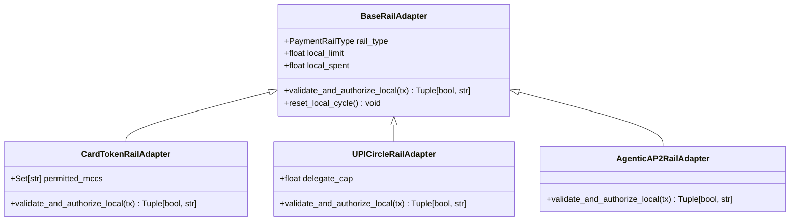

# LEARN_05 — Attacks and Simulator

> **Prerequisites:** [LEARN_01](LEARN_01_WHAT_AND_WHY.md), [LEARN_04](LEARN_04_THE_DTL_CORE.md)  
> **You will be able to:**
> - Explain the mechanics of the three standards-inspired payment rail adapters.
> - Trace the execution of the original nine executable attack vectors in the red team suite (plus 6 more added later — see the table near the end of this chapter, and LEARN_16/17/20).
> - Understand how `taxonomy.py` dynamically parses `docs/taxonomy.md` into structured records.
> - Articulate why 46 vectors in the 63-vector taxonomy are explicitly classified as research-only.  
> **Files this chapter is about:** `backend/app/simulator/state_machine.py`, `backend/app/simulator/adapters/*.py`, `backend/app/redteam/vectors/*.py`, `backend/app/taxonomy.py`, `docs/taxonomy.md`

---

## 1. The Multi-Rail Simulator Engine

🧒 **Like you're five**  
Imagine a big pretend town with three different shops: a card grocery store, a phone payment store, and a robot internet store. In our computer simulator, each shop has its own toy cash register. The cash register knows its own rules, but it has no wire connecting it to the other shops.

🏪 **In real life**  
Building a research prototype on live banking switches is impossible: real payment switches (Visa, NPCI, Mastercard) require regulatory banking licenses and proprietary network interfaces. FORSETI implements **standards-inspired simulated rail adapters** that replicate the exact data contracts, validation rules, and local visibility limits of real rails without external connectivity (`docs/RESPONSIBLE_RESEARCH.md`).

🎓 **Properly**  
The simulator engine `PaymentSimulatorEngine` (`backend/app/simulator/state_machine.py:12`) orchestrates the payment lifecycle across three concrete rail adapters derived from `BaseRailAdapter` (`backend/app/simulator/adapters/base.py:11`):



### The Three Rail Adapters

1. **Card Token Rail (`CardTokenRailAdapter`, `card_adapter.py:12`):**
   - **Industry Standard Inspired by:** EMV Payment Tokenization / Mastercard Digital Enablement Service (MDES).
   - **Local Guard Logic:** Checks that the transaction MCC is within its local allowlist `{"5411", "5499", "4900", "5311"}` and enforces its own local ₹10,000 monthly limit (`card_adapter.py:22`).
2. **UPI-Circle Rail (`UPICircleRailAdapter`, `upi_adapter.py:11`):**
   - **Industry Standard Inspired by:** NPCI UPI-Circle Circular OC 201-B for delegated secondary wallets.
   - **Local Guard Logic:** Enforces a dedicated delegate cap (default ₹10,000) per delegation cycle (`upi_adapter.py:20`).
3. **Agentic AP2 Rail (`AgenticAP2RailAdapter`, `agentic_adapter.py:13`):**
   - **Industry Standard Inspired by:** Google Agentic Protocol / AP2 / W3C Web Payments.
   - **Local Guard Logic:** Verifies intent-to-cart cryptographic hash chaining and enforces an autonomous machine mandate cap (`agentic_adapter.py:22`).

---

## 2. The Original Nine Executable Attack Vectors

FORSETI's original red team suite comprised nine fully implemented attack vectors that directly target authority dimensions (6 more were added later — see §4):

```
┌────────────────────────────────────────────────────────────────────────┐
│              THE ORIGINAL 9 EXECUTABLE ATTACK VECTORS                  │
├────┬─────────────────────────┬──────────────────┬──────────────────────┤
│ ID │ Attack Vector Key       │ Target Dimension │ Defeating Invariant  │
├────┼─────────────────────────┼──────────────────┼──────────────────────┤
│ 1  │ CROSS_RAIL_SPLIT        │ AMOUNT           │ INV_01_GLOBAL_BUDGET │
│ 2  │ INTENT_LAUNDERING       │ PURPOSE          │ INV_02_SEMANTIC_DRIFT│
│ 3  │ BASELINE_POISONING      │ PURPOSE          │ INV_02_SEMANTIC_DRIFT│
│ 4  │ REVOCATION_FLOOD        │ AMOUNT           │ INV_01_GLOBAL_BUDGET │
│ 5  │ VELOCITY_BURST          │ AMOUNT           │ INV_01_GLOBAL_BUDGET │
│ 6  │ SCOPE_CREEP             │ MERCHANT         │ INV_03_UNAUTH_MCC    │
│ 53 │ RAIL_SCOPE_VIOLATION    │ RAIL             │ INV_04_UNAUTH_RAIL   │
│ 54 │ PER_TX_BREACH           │ PER_TX           │ INV_05_PER_TX_CAP    │
│ 55 │ LAPSED_MANDATE          │ TIME             │ INV_06_AUTH_EXPIRED  │
└────┴─────────────────────────┴──────────────────┴──────────────────────┘
```

---

### Deep-Dive: The Nine Attacks

#### 1. `CROSS_RAIL_SPLIT` (Flagship Vector, ID 1)
- **Source File:** `backend/app/redteam/vectors/cross_rail_split.py:20`
- **Attack Payload:** Emits three ₹4,000 transactions across `CARD_TOKEN`, `UPI_CIRCLE`, and `AGENTIC_AP2` against a ₹10,000 budget (`cross_rail_split.py:44`).
- **Local Rail Behavior:** All three rails approve locally ($₹4,000 \le ₹10,000$).
- **DTL Defense:** Defeated on Leg 3 by `INV_01_GLOBAL_BUDGET_EXCEEDED` ($₹8,000 + ₹4,000 = ₹12,000 > ₹10,000$).

#### 2. `INTENT_LAUNDERING` (ID 2)
- **Source File:** `backend/app/redteam/vectors/intent_laundering.py:12`
- **Attack Payload:** Purchases a ₹9,500 basket at a grocery store (MCC 5411) containing a ₹1,000 grocery item and an ₹8,500 digital gift card (`is_stored_value=True`).
- **Local Rail Behavior:** Approves because MCC 5411 is allowed and ₹9,500 is within the monetary ceiling.
- **DTL Defense:** Defeated by `INV_02_SEMANTIC_INTENT_DRIFT`. Cost Governor applies `PARTIAL_AUTH`, approving the ₹1,000 grocery portion and quarantining the ₹8,500 gift card.

#### 3. `BASELINE_POISONING` (ID 3)
- **Source File:** `backend/app/redteam/vectors/other_vectors.py:14`
- **Attack Payload:** Incrementally injects small stored-value gift vouchers (₹200 $\to$ ₹500 $\to$ ₹1,200) over successive cycles to slowly shift the baseline spending profile.
- **DTL Defense:** Caught by `INV_02_SEMANTIC_INTENT_DRIFT` due to strict SKU attestation.

#### 4. `REVOCATION_FLOOD` (ID 4)
- **Source File:** `backend/app/redteam/vectors/other_vectors.py:38`
- **Attack Payload:** Emits rapid micro-transactions accompanied by simulated authority revocation and regrant requests to create synchronization lag in distributed caches.
- **DTL Defense:** In-memory atomic exposure tracking in `DTLLedger` evaluates current global balance synchronously and catches budget overruns via `INV_01`.

#### 5. `VELOCITY_BURST` (ID 5)
- **Source File:** `backend/app/redteam/vectors/other_vectors.py:61`
- **Attack Payload:** Dispatches 5 high-frequency transactions within a 2-second burst to exploit asynchronous clearing latency.
- **DTL Defense:** Two-phase exposure tracking locks pending funds immediately on Leg 1, preventing subsequent burst legs from overspending via `INV_01`.

#### 6. `SCOPE_CREEP` (ID 6)
- **Source File:** `backend/app/redteam/vectors/other_vectors.py:84`
- **Attack Payload:** Attempts transactions at electronics stores (MCC 5732) or jewellery merchants (MCC 5944) while operating under a grocery-only grant.
- **DTL Defense:** Defeated by `INV_03_UNAUTHORIZED_MCC`. Routed to shadow ledger via `SCOPE_QUARANTINE`.

#### 7. `RAIL_SCOPE_VIOLATION` (ID 53)
- **Source File:** `backend/app/redteam/vectors/authority_scope.py:33`
- **Target Grant Profile:** `permitted_rails = [UPI_CIRCLE, AGENTIC_AP2]` (Cards prohibited).
- **Attack Payload:** Agent attempts a payment on `CARD_TOKEN` (`authority_scope.py:53`).
- **DTL Defense:** Defeated by `INV_04_UNAUTHORIZED_RAIL`. Cost Governor applies `RAIL_SCOPE_BLOCK` without consuming headroom.

#### 8. `PER_TX_BREACH` (ID 54)
- **Source File:** `backend/app/redteam/vectors/authority_scope.py:73`
- **Target Grant Profile:** Global ceiling ₹10,000, `per_transaction_cap = ₹3,000.00`.
- **Attack Payload:** Dispatches a single ₹6,500 transaction (`authority_scope.py:93`).
- **DTL Defense:** Defeated by `INV_05_PER_TX_CAP_EXCEEDED`. Cost Governor applies `STEP_UP_REQUIRED` for human biometric confirmation.

#### 9. `LAPSED_MANDATE` (ID 55)
- **Source File:** `backend/app/redteam/vectors/authority_scope.py:115`
- **Target Grant Profile:** 168-hour validity window created at $T_0$.
- **Attack Payload:** Dispatches a transaction evaluated at $T_0 + 200\text{h}$ (`authority_scope.py:136`).
- **DTL Defense:** Defeated by `INV_06_AUTHORITY_EXPIRED`. Held for re-consent via `RE_CONSENT_HOLD`.

---

## 3. The 63-Vector Taxonomy & Dynamic Parser

The repository contains a comprehensive 63-vector attack matrix documented in `docs/taxonomy.md`. The Python module `backend/app/taxonomy.py` dynamically parses this markdown file at runtime (`taxonomy.py:136`):

```
┌────────────────────────────────────────────────────────────────────────┐
│                      63-VECTOR ATTACK TAXONOMY                         │
│  Parsed from `docs/taxonomy.md` by `backend/app/taxonomy.py`           │
├────────────────────────────────────────────────────────────────────────┤
│  5 Channels:                                                           │
│    C1: Card present / card-not-present                                 │
│    C2: UPI & real-time rails                                           │
│    C3: Agentic AI / machine commerce                                   │
│    C4: Digital wallets / stored value                                  │
│    C5: Cross-border & settlement                                       │
│                                                                        │
│  8 Attack Surfaces:                                                    │
│    S1: Identity & onboarding        S5: Settlement & reconciliation    │
│    S2: Authentication & credentials S6: Dispute & chargeback           │
│    S3: Transaction authorization    S7: Agent-to-agent delegation      │
│    S4: Merchant & catalog integrity S8: Human-in-the-loop engineering  │
├────────────────────────────────────────────────────────────────────────┤
│  STATUS BREAKDOWN:                                                     │
│  • 17 Executable Vectors (`implemented=True`, `taxonomy.py`'s          │
│    `IMPLEMENTED` dict) - 9 original + 6 from the Agentic Security      │
│    Runtime expansion (§4 below) + 2 Settlement Reconciliation          │
│    vectors (LEARN_21)                                                  │
│  • 46 Research-Only Vectors (`implemented=False`, unchanged)           │
└────────────────────────────────────────────────────────────────────────┘
```

### Why Distinguish Executable from Research Vectors?

Many academic and industry papers present large attack taxonomies and imply that all vectors are simulated and defended. FORSETI upholds strict scientific honesty:
- The executable vectors have full Python implementation classes in `backend/app/redteam/vectors/` and run live in the arena.
- The research-only vectors represent threats identified in financial literature (e.g. SIM swap attacks, physical POS skimming, chargeback fraud) that are outside the scope of agentic delegation defense.
- `GET /api/attacks` returns the entire taxonomy, with each record explicitly carrying `"implemented": true | false` (`taxonomy.py`).

---

## 4. The Six Vectors Added by the Agentic Security Runtime Expansion

The taxonomy grew from 55 to 61 vectors, and from 9 to 15 executable, in the Agentic Payment Security Runtime expansion. These 6 new executable vectors are covered in full in their own chapters rather than repeated here:

| ID | Vector | Round | Dimension / Layer | Chapter |
|---|---|---:|---|---|
| 56 | `BENEFICIARY_DRIFT` | 10 | BENEFICIARY (7th dim) | [LEARN_16](LEARN_16_INTENT_FIREWALL.md) |
| 57 | `PROMPT_INJECTION` | 11 | Deception Lab | [LEARN_17](LEARN_17_DECEPTION_LAB.md) |
| 58 | `TOOL_OUTPUT_POISONING` | 12 | Deception Lab | [LEARN_17](LEARN_17_DECEPTION_LAB.md) |
| 59 | `CONTEXT_MEMORY_POISONING` | 13 | Deception Lab | [LEARN_17](LEARN_17_DECEPTION_LAB.md) |
| 60 | `AUTHORITY_IMPERSONATION` | 14 | Deception Lab | [LEARN_17](LEARN_17_DECEPTION_LAB.md) |
| 61 | `CONSTRAINT_EROSION` | 15 | PURPOSE (reuses `INV_02`, no new invariant) | [LEARN_20](LEARN_20_ADAPTIVE_IMMUNE_SYSTEM.md) |

`CONSTRAINT_EROSION` is worth a special note here: it spreads purpose drift across 4 escalating legs (groceries → small store-credit slice → larger voucher → near-total crypto-token conversion) instead of one obvious spike, to demonstrate that `INV_02_SEMANTIC_INTENT_DRIFT` is a deterministic membership check, not a threshold — it catches the small first slice exactly as reliably as the blatant last one. It also fills what was previously the unmapped `GOAL_HIJACKING` kill-chain stage (LEARN_18).

Two more vectors closed the LAST unmapped kill-chain stages — neither is an authority-dimension attack, so neither reuses an existing invariant:

| ID | Vector | Round | Dimension / Layer | Chapter |
|---|---|---:|---|---|
| 62 | `SETTLEMENT_CONFLICT` | 16 | SETTLEMENT_INTEGRITY (`RECON_01`, post-authorization) | [LEARN_21](LEARN_21_TOKENIZATION.md) |
| 63 | `RECONCILIATION_DRIFT` | 17 | SETTLEMENT_INTEGRITY (`RECON_02`, post-authorization) | [LEARN_21](LEARN_21_TOKENIZATION.md) |

With these two, all 11 Kill Chain stages now have an implemented vector behind them — see LEARN_18 and LEARN_21.

---

## Check yourself

1. **Which rail adapters are simulated in FORSETI?**
2. **What is the difference between `CROSS_RAIL_SPLIT` and `INTENT_LAUNDERING`?**
3. **Why do local rail adapters approve their respective legs during a cross-rail split attack?**
4. **How many total vectors are in the taxonomy, and how many are executable?**
5. **Which invariant defeats the `PER_TX_BREACH` attack vector?**

<details>
<summary>Answers</summary>

1. `CardTokenRailAdapter` (MDES/VTS-inspired), `UPICircleRailAdapter` (UPI-Circle OC 201-B inspired), and `AgenticAP2RailAdapter` (Google AP2-inspired).
2. `CROSS_RAIL_SPLIT` exploits the multi-rail blind spot by dividing money across payment channels; `INTENT_LAUNDERING` exploits merchant category coarseness by purchasing stored-value gift cards under legitimate grocery MCCs.
3. Because each rail adapter only evaluates the transaction against its own local limit ($₹4,000 \le ₹10,000$) and cannot see spend occurring on other rails.
4. 63 total vectors in `docs/taxonomy.md`; 17 are executable in code (`backend/app/taxonomy.py`'s `IMPLEMENTED` dict) — the original 9, plus 6 added by the Agentic Security Runtime expansion, plus 2 Settlement Reconciliation vectors (§4).
5. `INV_05_PER_TX_CAP_EXCEEDED` (`backend/app/dtl/invariant_engine.py:252`).
</details>

---

## Where to go next
→ [LEARN_06 — The ML Model](LEARN_06_THE_ML_MODEL.md)
