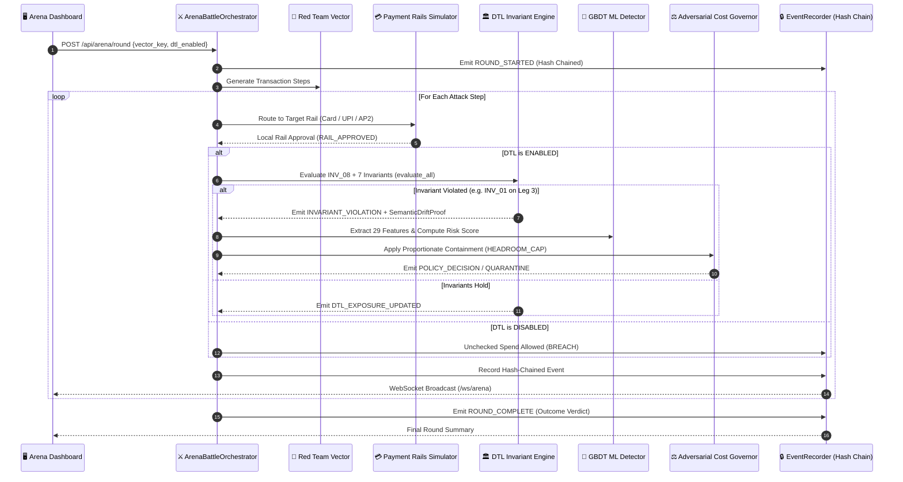

# LEARN_07: Arena and Events

> **Prerequisites:** [LEARN_03](LEARN_03_MAP_OF_THE_CODEBASE.md), [LEARN_04](LEARN_04_THE_DTL_CORE.md)  
> **You will be able to:**
> - Trace the step-by-step lifecycle of an interactive battle round in `ArenaBattleOrchestrator`.
> - Understand the complete event vocabulary (23 original + 3 added by the Agentic Security Runtime expansion) and the nine system actors.
> - Explain the mathematics and implementation of the SHA-256 tamper-evident event hash chain.
> - Differentiate the three distinct round outcomes (`BLUE/CONTAINED`, `RED/UNCHECKED_BREACH`, `NONE/WITHIN_AUTHORITY`).  
> **Files this chapter is about:** `backend/app/arena/events.py`, `backend/app/arena/orchestrator.py`, `backend/app/main.py`

---

## 1. The Live Arena Orchestrator

🧒 **Like you're five**  
Imagine a sports referee who blows the whistle and runs a friendly match between a Red robot player (trying tricky shopping moves) and a Blue robot goalie (protecting Mum's money rules). The referee blows the whistle to start the round, plays each step in slow motion so everyone in the stadium can watch, checks the rulebook, stamps an unchangeable match report, and announces who won!

🏪 **In real life**  
During a live security demonstration or automated red-blue evaluation, human operators need to observe how an attack unfolds step-by-step across payment rails. The `ArenaBattleOrchestrator` (`backend/app/arena/orchestrator.py:38`) paces the simulation (e.g. 500 ms per step), emitting granular JSON events to the WebSocket stream so the frontend dashboard can animate each transaction leg, highlight active SVG graph nodes, and display real-time SHAP attributions.

🎓 **Properly**  
The orchestrator executes a multi-phase state machine coordinating Red team vector generation, rail adapter routing, DTL invariant evaluation, ML inference scoring, cost governor containment, post-quantum audit signing, and closed-loop feedback adaptation (`backend/app/arena/orchestrator.py:270`):



---

## 2. The Event Vocabulary (23 Event Types across 5 Families)

Every action in the system is logged as a strongly-typed `ArenaEvent` (`backend/app/arena/events.py:73`). The 23 event types are divided into five logical families (`events.py:11`):

```
┌────────────────────────────────────────────────────────────────────────┐
│                        ARENA EVENT VOCABULARY                          │
├──────────────┬─────────────────────────────────────────────────────────┤
│ Family       │ Event Types                                             │
├──────────────┼─────────────────────────────────────────────────────────┤
│ 1. Lifecycle │ • ROUND_STARTED: Battle round initialized               │
│              │ • ATTACK_STARTED: Red team begins attack sequence       │
│              │ • ATTACK_STEP: Individual transaction leg dispatched    │
│              │ • ATTACK_COMPLETE: Red sequence finished                │
│              │ • ROUND_COMPLETE: Round finalized with final verdict    │
├──────────────┼─────────────────────────────────────────────────────────┤
│ 2. Rail      │ • RAIL_REQUEST: Step routed to rail adapter             │
│              │ • RAIL_APPROVED: Rail approves locally                  │
│              │ • RAIL_DECLINED: Rail rejects locally                   │
├──────────────┼─────────────────────────────────────────────────────────┤
│ 3. DTL State │ • AUTHORITY_GRANTED: Initial authority profile loaded   │
│              │ • DTL_EVALUATION: Invariant engine running checks       │
│              │ • DTL_EXPOSURE_UPDATED: Exposure balance booked         │
│              │ • INVARIANT_VIOLATION: Invariant failure detected       │
├──────────────┼─────────────────────────────────────────────────────────┤
│ 4. Detection │ • ML_SCORE: Calibrated GBDT risk probability emitted    │
│ & Response   │ • SHAP_EXPLANATION: Feature attributions calculated     │
│              │ • POLICY_DECISION: Defense policy response determined   │
│              │ • PARTIAL_AUTH: Legitimate SKUs approved, rest held     │
│              │ • QUARANTINE: Transaction routed to shadow ledger       │
│              │ • CAPABILITY_REDUCTION: Headroom or rail scope locked   │
│              │ • INTENT_FIREWALL_VERDICT: per-tx drift vector (LEARN_16)│
│              │ • DECEPTION_LAB_VERDICT: agent-reasoning check (LEARN_17)│
├──────────────┼─────────────────────────────────────────────────────────┤
│ 5. Audit &   │ • PQC_SIGN: State snapshot signed with ML-DSA-44        │
│ Feedback     │ • PQC_VERIFY: Audit signature verified                  │
│              │ • RED_ADAPTATION: Red planner updates attack strategy   │
│              │ • BLUE_ADAPTATION: Blue defender tightens policy        │
│              │   (now escalates on repetition - see LEARN_20)          │
│              │ • EVALUATION_COMPLETE: Round scorecard written to disk  │
└──────────────┴─────────────────────────────────────────────────────────┘
```

> **`INTENT_FIREWALL_VERDICT` and `DECEPTION_LAB_VERDICT` fire on EVERY step**, not only on a violation/detection, `ALLOW` and `CLEAN` are real, informative verdicts, so "nothing happened" is exactly as visible in the live log as a breach is. Both were added by the Agentic Security Runtime expansion; the original 23-type vocabulary is otherwise unchanged.
>
> The expansion also added `POST /api/arena/campaign`. Runs a server-orchestrated sequence of rounds in one call (default: `RAIL_SCOPE_VIOLATION` ×3, demonstrating the Blue escalation ladder end to end), streaming every constituent round's events over this SAME `/ws/arena` socket. See [LEARN_20](LEARN_20_ADAPTIVE_IMMUNE_SYSTEM.md).

### The Nine System Actors

The `actor` field on each event explicitly identifies the issuing component (`backend/app/arena/events.py:46`):
- `RED_AGENT`: Adversarial attack generator.
- `BLUE_DEFENDER`: Defensive orchestration controller.
- `PAYMENT_RAIL`: Simulated rail adapter (Card, UPI, AP2).
- `DTL_CORE`: Delegation-Trust Ledger and Invariant Engine.
- `ML_DETECTOR`: GBDT inference engine.
- `PQC_AUDIT`: Post-quantum cryptographic audit signer.
- `ORCHESTRATOR`: Battle supervisor and clock coordinator.
- `HUMAN_PRINCIPAL`: User setting authority constraints.
- `ADAPTIVE_FEEDBACK`: Closed-loop policy adaptation engine.

---

## 3. The SHA-256 Tamper-Evident Hash Chain

Every event recorded during an arena round is cryptographically bound to the entire preceding history using an append-only SHA-256 hash chain (`backend/app/arena/events.py:131`).

```
Genesis State: prev_hash = "0000000000000000000000000000000000000000000000000000000000000000"

Event 1: entry_hash_1 = SHA256( prev_hash_0 || canonical_json(Event_1) )
                            │
Event 2: entry_hash_2 = SHA256( entry_hash_1 || canonical_json(Event_2) )
                            │
Event 3: entry_hash_3 = SHA256( entry_hash_2 || canonical_json(Event_3) )
```

### Hash Chaining Code Implementation

```python
# backend/app/arena/events.py:145
def _compute_hash(self, event_dict: Dict[str, Any], prev_hash: str) -> str:
    """
    Computes SHA-256 over prev_hash concatenated with canonical JSON event bytes.
    """
    # Exclude dynamic hash fields before hashing
    clean_dict = {k: v for k, v in event_dict.items() if k not in ("entry_hash", "prev_entry_hash")}
    canonical_bytes = canonical_json_bytes(clean_dict)
    hasher = hashlib.sha256()
    hasher.update(prev_hash.encode("utf-8"))
    hasher.update(canonical_bytes)
    return hasher.hexdigest()
```

### Three Destinations, One Object

When `EventRecorder.record()` runs (`events.py:131`), the exact same event object is dispatched to three destinations simultaneously:
1. **In-Memory Buffer:** Stored in `self.events` for instant retrieval via `GET /api/arena/events`.
2. **Persistent Disk File:** Appended as JSONL to `artifacts/events/<experiment_id>.jsonl`.
3. **Real-Time WebSocket Stream:** Broadcast over `/ws/arena` to all connected UI clients.

---

## 4. The Three Possible Round Outcomes

A critical honesty fix in FORSETI was the formal separation of three distinct round verdicts (`backend/app/arena/orchestrator.py:652`):

```python
# backend/app/arena/orchestrator.py:652
if dtl_enabled:
    if violation_count > 0:
        outcome = "BLUE/CONTAINED"
    else:
        outcome = "NONE/WITHIN_AUTHORITY"
else:
    outcome = "RED/UNCHECKED_BREACH"
```

```
┌────────────────────────────────────────────────────────────────────────┐
│                        THREE ROUND OUTCOMES                            │
├────────────────────────┬───────────────────────────────────────────────┤
│ Outcome Code           │ Meaning & Interpretation                      │
├────────────────────────┼───────────────────────────────────────────────┤
│ 1. BLUE/CONTAINED      │ An attack was launched; the DTL invariant or  │
│                        │ cost governor caught it and contained spend.  │
├────────────────────────┼───────────────────────────────────────────────┤
│ 2. RED/UNCHECKED_BREACH│ An attack was launched, but DTL checking was  │
│                        │ disabled; the attack breached budget checks.  │
├────────────────────────┼───────────────────────────────────────────────┤
│ 3. NONE/WITHIN_AUTHORITY│ Legitimate traffic was dispatched; no attack  │
│                        │ occurred and spend remained inside authority. │
└────────────────────────┴───────────────────────────────────────────────┘
```

### Why Conflating `NONE` with `BLUE` Was a Real Bug

In earlier versions of the test harness, any round that did not result in an unchecked breach was automatically recorded as a "Blue Win" (`BLUE/CONTAINED`). This created a serious reporting distortion: normal, non-adversarial grocery purchases were reported as successful defensive victories!

Separating `NONE/WITHIN_AUTHORITY` ensures that Blue victories are claimed **only when an actual invariant violation was intercepted and contained**.

---

## Check yourself

1. **How many event types and actor roles are in the arena event vocabulary?**
2. **What is the mathematical formula for computing an event's `entry_hash`?**
3. **What are the three destinations every recorded event is sent to?**
4. **Under what condition does a round conclude with `RED/UNCHECKED_BREACH`?**
5. **Why is `NONE/WITHIN_AUTHORITY` distinct from `BLUE/CONTAINED`?**

<details>
<summary>Answers</summary>

1. 26 event types across 5 families (the original 23, plus `INTENT_FIREWALL_VERDICT` and `DECEPTION_LAB_VERDICT` from the Agentic Security Runtime expansion), and 9 distinct system actors (`backend/app/arena/events.py`).
2. $\text{entry\_hash} = \text{SHA256}(\text{prev\_hash} \parallel \text{canonical\_json}(\text{event}))$, with genesis hash `"0"*64` (`backend/app/arena/events.py:145`).
3. (1) In-memory event array, (2) JSONL disk file (`artifacts/events/<id>.jsonl`), and (3) WebSocket `/ws/arena` stream (`backend/app/arena/events.py:131`).
4. When an adversarial attack is executed with DTL checking toggled off (`dtl_enabled=False`), allowing transactions to exceed budget limits without containment (`backend/app/arena/orchestrator.py:652`).
5. `NONE/WITHIN_AUTHORITY` denotes legitimate traffic that stayed within bounds without triggering violations, whereas `BLUE/CONTAINED` denotes an active attack that was intercepted and contained by an invariant.
</details>

---

## Where to go next
→ [LEARN_08. Crypto Audit](LEARN_08_CRYPTO_AUDIT.md)
