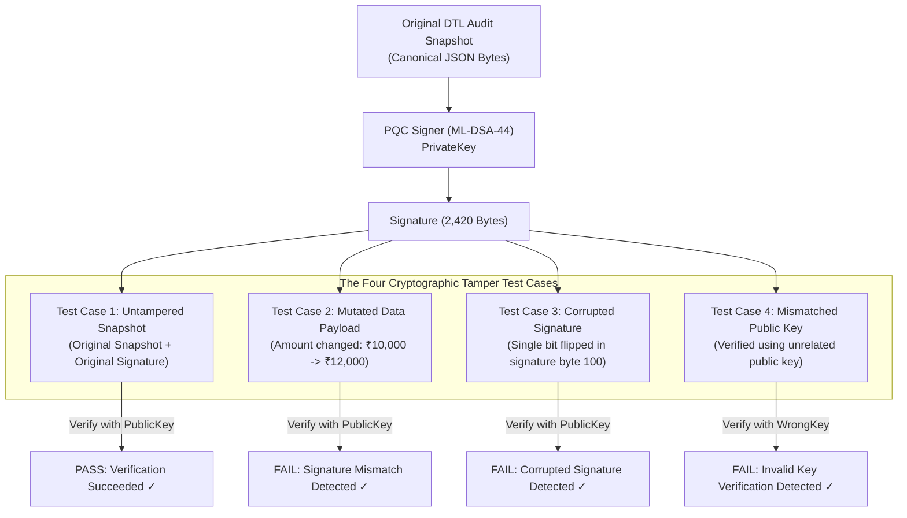

# LEARN_08 — Cryptographic Audit & Post-Quantum Signatures

> **Prerequisites:** [LEARN_01](LEARN_01_WHAT_AND_WHY.md), [LEARN_07](LEARN_07_ARENA_AND_EVENTS.md)  
> **You will be able to:**
> - Explain the fundamental cryptographic difference between hash chaining and digital signatures.
> - Articulate why post-quantum cryptography (PQC) is required for long-term financial audit logs.
> - Understand the NIST FIPS 204 ML-DSA-44 (Dilithium) parameter sizes and lattice mechanics.
> - Trace RFC 8785 JSON canonicalization and why deterministic byte serialization is essential.
> - Execute and verify the four automated tamper test cases.  
> **Files this chapter is about:** `backend/app/crypto/canonicalization.py`, `backend/app/crypto/key_store.py`, `backend/app/crypto/pqc_provider.py`, `backend/app/crypto/mldsa_audit.py`

---

## 1. Hashing vs. Signing: Why a Hash Chain Is Not Enough

🧒 **Like you're five**  
Imagine you write your diary with page numbers linked together: Page 2 says "Page 1 was 50 words", and Page 3 says "Page 2 was 40 words" (that is a *hash chain*). If someone steals your notebook, they could erase everything, rewrite all three pages from scratch, recalculate the word counts, and pretend nothing happened. But if the principal stamps every page with an unbreakable wax seal from their personal signet ring (a *digital signature*), nobody can fake the diary without the ring!

🏪 **In real life**  
An adversary who gains root access to a logging server can modify a historical record (e.g. changing an intercepted ₹12,000 cross-rail breach to ₹4,000) and simply recompute the SHA-256 hashes of all subsequent log entries from that point forward. 

To make logs **tamper-evident against server compromise**, the system periodically bundles the latest state into a snapshot and signs it with a private key held in a secure enclave. Anyone holding the public key can independently verify that the log has not been rewritten.

```
┌────────────────────────────────────────────────────────────────────────┐
│                        HASH CHAIN vs DIGITAL SIGNATURE                 │
├────────────────────────────────┬───────────────────────────────────────┤
│ SHA-256 Hash Chain             │ ML-DSA-44 Digital Signature           │
├────────────────────────────────┼───────────────────────────────────────┤
│ • Proves sequence ordering.    │ • Proves authenticity and origin.     │
│ • Detects accidental corruption│ • Detects deliberate attacker forgery.│
│ • Symmetrical (anyone can hash)│ • Asymmetrical (only keyholder signs).│
└────────────────────────────────┴───────────────────────────────────────┘
```

---

## 2. Why Post-Quantum Cryptography (NIST FIPS 204)?

Traditional digital signatures (RSA and Elliptic Curve Cryptography / ECDSA) rely on mathematical problems: integer factorization and discrete logarithms. **Shor's Algorithm** running on a sufficiently large quantum computer can solve these problems in polynomial time, completely breaking RSA and ECC signatures.

Financial audit logs are subject to strict regulatory retention mandates:
- **Banking Audit Retention:** Under RBI, Basel III, and international banking regulations, audit trails of financial delegations and containment actions must remain legally verifiable for **7 to 20 years**.
- **Harvest Now, Decrypt / Forge Later:** Adversaries are currently archiving encrypted data and signed audit logs to forge or rewrite historical records once quantum hardware matures.

FORSETI protects long-term audit integrity by implementing **NIST FIPS 204 ML-DSA-44** (Module-Lattice Digital Signature Algorithm, formerly known as Dilithium).

```
┌────────────────────────────────────────────────────────────────────────┐
│                   NIST FIPS 204 ML-DSA-44 PARAMETERS                   │
│  `backend/app/crypto/pqc_provider.py:31`                               │
├──────────────────────────────────────┬─────────────────────────────────┤
│ Security Category                    │ NIST Category 2 (AES-128 equiv) │
│ Public Key Size (`_PK_BYTES`)        │ 1,312 bytes                     │
│ Secret Key Size (`_SK_BYTES`)        │ 2,560 bytes                     │
│ Signature Size (`_SIG_BYTES`)        │ 2,420 bytes                     │
│ Mathematical Hardness                │ Module Learning With Errors     │
│                                      │ (M-LWE) over polynomial rings   │
└──────────────────────────────────────┴─────────────────────────────────┘
```

---

## 3. Deterministic Canonicalization (RFC 8785)

Digital signatures sign **exact sequences of bytes**. A JSON object in Python can be serialized in hundreds of different ways:

```json
{"amount": 1000.0, "rail": "UPI"}
{"rail":"UPI","amount":1000.0}
{
  "amount": 1000.0,
  "rail": "UPI"
}
```

All three JSON strings represent the same semantic data, but produce completely different SHA-256 hashes and invalid signatures.

FORSETI implements strict deterministic JSON canonicalization conforming to **RFC 8785** (`backend/app/crypto/canonicalization.py:15`):

```python
# backend/app/crypto/canonicalization.py:27
def canonical_json_bytes(obj: Any) -> bytes:
    """
    Converts a Python dict/object into deterministic canonical UTF-8 JSON bytes:
    - Keys sorted lexicographically at all nesting depths.
    - Compact separators (',' and ':') with zero extraneous whitespace.
    - Floats formatted without trailing zeros (e.g. 1000.0 -> 1000.0).
    """
    serialized = json.dumps(
        obj,
        sort_keys=True,
        separators=(",", ":"),
        ensure_ascii=False,
        default=str
    )
    return serialized.encode("utf-8")
```

---

## 4. The Development Key Store

The key store (`backend/app/crypto/key_store.py:22`) manages the ML-DSA-44 keypair:
- **Reproducible Determinism:** When initializing in test environments, keys are derived deterministically using `SEED=42` (`key_store.py:44`) so that test runs produce identical, reproducible signatures.
- **Honest Framing Boundary:** The key store is explicitly labeled as a **development prototype key store**. It does NOT implement hardware security module (HSM) key protection or PKCS#11 key management (`key_store.py:8`).

---

## 5. The Four Automated Tamper Tests

To prove the post-quantum audit layer works, FORSETI implements a comprehensive four-case verification battery in `backend/app/crypto/mldsa_audit.py:80` and `backend/tests/test_forseti.py:445` (`TestPQC`):



```
┌────────────────────────────────────────────────────────────────────────┐
│                      FOUR TAMPER TEST RESULTS                          │
│  Verified by `python tasks.py pqc-test`                                │
├────┬─────────────────────────────┬─────────────────┬───────────────────┤
│ #  │ Test Scenario               │ Expected Result │ Measured Output   │
├────┼─────────────────────────────┼─────────────────┼───────────────────┤
│ 1  │ Authentic Snapshot          │ Verified        │ TRUE (Verified ✓) │
│ 2  │ Mutated Payload (Tampered)  │ Verification Fail│ FALSE (Caught ✓)  │
│ 3  │ Mutated Signature (Corrupted│ Verification Fail│ FALSE (Caught ✓)  │
│ 4  │ Wrong Public Key            │ Verification Fail│ FALSE (Caught ✓)  │
└────┴─────────────────────────────┴─────────────────┴───────────────────┘
```

You can execute this test suite directly from your terminal:
```bash
python tasks.py pqc-test
```

---

## 6. What This Layer Does NOT Protect

Security claims must define their exact threat boundary (`docs/RESPONSIBLE_RESEARCH.md`):

1. **Does NOT Prevent Real-Time Attack Execution:** The cryptographic audit layer generates post-hoc unforgeable proof of containment; it does not block the transaction itself (that is the job of the DTL Invariant Engine).
2. **Does NOT Provide Key Secrecy on Compromised Hosts:** In this development prototype, private keys reside in application memory rather than a FIPS 140-3 Level 4 Hardware Security Module.
3. **Does NOT Sign Every Individual Packet:** Signatures are computed over **epoch audit snapshots** of the event log to keep inline transaction latency under 1 millisecond.

---

## Check yourself

1. **Why is a SHA-256 hash chain alone vulnerable to an attacker with server access?**
2. **What quantum algorithm threatens traditional RSA and ECC cryptography?**
3. **What are the public key, secret key, and signature byte sizes for ML-DSA-44?**
4. **Why is RFC 8785 canonicalization necessary before generating digital signatures?**
5. **Describe the four automated tamper test cases implemented in `mldsa_audit.py`.**

<details>
<summary>Answers</summary>

1. Because an attacker who modifies a log file can recalculate all subsequent SHA-256 hashes from that point forward unless the log is anchored by an asymmetric digital signature.
2. Shor's Algorithm.
3. Public key: 1,312 bytes, Secret key: 2,560 bytes, Signature: 2,420 bytes (`backend/app/crypto/pqc_provider.py:31-33`).
4. To ensure that JSON objects serialize to the exact same deterministic byte sequence across all operating systems and Python runtimes.
5. (1) Authentic snapshot verification (passes), (2) Mutated data payload (fails), (3) Corrupted signature bits (fails), and (4) Wrong public key verification (fails) (`backend/app/crypto/mldsa_audit.py:80`).
</details>

---

## Where to go next
→ [LEARN_09 — AI Agent Layer](LEARN_09_AI_AGENT_LAYER.md)
