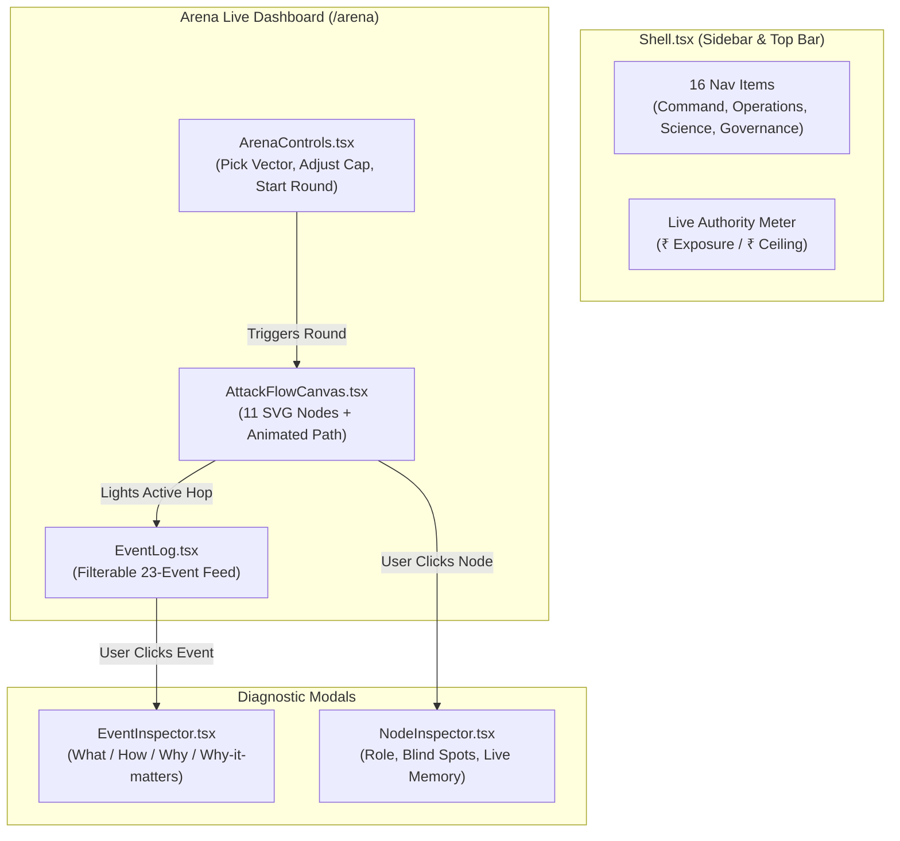

# LEARN_10: The Frontend Architecture & Dashboard

> **Prerequisites:** [LEARN_02](LEARN_02_TECH_STACK.md), [LEARN_03](LEARN_03_MAP_OF_THE_CODEBASE.md), [LEARN_07](LEARN_07_ARENA_AND_EVENTS.md)  
> **You will be able to:**
> - Understand the Next.js 16 App Router layout structure and TypeScript data typing.
> - Trace how `ArenaProvider.tsx` consumes the backend WebSocket stream and derives reactive UI state.
> - Explain the architecture of the SVG `AttackFlowCanvas` and component inspector modals.
> - Map all 16 dashboard pages to their corresponding backend REST endpoints and artifact files.
> - Explain the role of the Honesty UI components (`NotRun`, `Provenance`).  
> **Files this chapter is about:** `frontend/app/layout.tsx`, `frontend/app/lib/ArenaProvider.tsx`, `frontend/app/lib/types.ts`, `frontend/app/components/*`, `frontend/app/**/page.tsx`

---

## 1. Next.js 16 App Router Architecture

The user interface is built as a Single Page Application (SPA) using Next.js 16 App Router and React 19.

```
frontend/app/
├─ layout.tsx                Root layout: wraps app in ArenaProvider and Shell
├─ page.tsx                  Command Overview landing page (/)
├─ globals.css               Tailwind CSS v4 entry
├─ lib/
│  ├─ api.ts                 Centralized typed REST API client & currency formatters
│  ├─ types.ts               TypeScript data contracts matching backend models
│  ├─ ArenaProvider.tsx      Single WebSocket provider & reactive state store
│  └─ useArtifact.ts         Custom hook for loading static evaluation JSONs
└─ components/
   ├─ Shell.tsx              Sidebar navigation (16 pages) & live exposure bar
   ├─ ui.tsx                 Reusable UI elements (Card, Stat, NotRun, Provenance)
   ├─ AttackFlowCanvas.tsx   Interactive SVG node graph
   ├─ ArenaControls.tsx      Attack launcher & parameter controls
   ├─ EventLog.tsx           Real-time filterable event feed
   ├─ EventInspector.tsx     Event diagnostic modal
   └─ NodeInspector.tsx      Component blind-spot inspector modal
```

---

## 2. Real-Time State Management (`ArenaProvider.tsx`)

🧒 **Like you're five**  
Imagine a big TV in the living room (`ArenaProvider`) connected to the stadium camera by a long wire (`WebSocket`). When the referee announces a play on the field, the TV instantly changes the scoreboard numbers, lights up the winning team's goal, and rings a bell!

🏪 **In real life**  
During a live arena attack, events arrive every 200–500 milliseconds. If individual components polled REST endpoints independently, the UI would suffer visual tearing, out-of-order logs, and redundant network requests. 

`ArenaProvider` (`frontend/app/lib/ArenaProvider.tsx:49`) establishes a **single auto-reconnecting WebSocket connection** to `ws://localhost:8000/ws/arena`. As events arrive, it updates an in-memory event buffer and computes derived reactive state:

```typescript
// frontend/app/lib/ArenaProvider.tsx
export interface ArenaContextType {
  connected: boolean;
  state: ArenaState;
  events: ArenaEvent[];
  exposure: number;            // Current total exposure global (₹)
  ceiling: number;             // Authority budget ceiling (₹)
  headroom: number;            // Remaining uncommitted budget (₹)
  litEdge: { from: string; to: string } | null;  // Active SVG graph edge
  nodeStates: Record<string, NodeVisualState>;    // Color/status per node
  executeRound: (params: RoundParams) => Promise<void>;
  resetArena: () => Promise<void>;
}
```

---

## 3. The Interactive Component Layer



### Key Components

1. **`AttackFlowCanvas.tsx` (357 lines):**  
   Renders an SVG graph of 11 fixed system nodes (Human Principal, Agent, Card Rail, UPI Rail, AP2 Rail, DTL Core, Invariant Engine, Cost Governor, ML Detector, SHAP Engine, PQC Signer). When an event occurs, `framer-motion` animates a glowing pulse along the active edge.
2. **`EventInspector.tsx`:**  
   Clicking any event in the live log opens this modal, which calls the AI Event Explainer (`/api/ai/event/explain`) or renders a deterministic diagnostic breakdown. `EventNumbers` (the raw-figures panel inside it) was extended to surface the Agentic Security Runtime expansion's new payload fields, drift score, deception detection type, escalation `violation_count`/`active_policy`, rather than building bespoke per-event-type sub-components.
3. **`NodeInspector.tsx`:**  
   Clicking any node on the SVG canvas explains the component's exact role, its architectural blind spots, and its current live state.

### New in the Agentic Security Runtime Expansion

The `/arena` page gained **three new cards**, all sourced entirely from `lastRound` (the round result the backend already returns from `POST /api/arena/round` and `/campaign`), **zero extra API calls**, since `firewall_verdicts`, `deception_verdicts`, and `kill_chain` are already attached to every round result server-side (LEARN_16, LEARN_17, LEARN_18):

```
┌────────────────────────────────────────────────────────────────────────┐
│         THREE NEW CARDS ON THE LIVE ARENA PAGE (arena/page.tsx)        │
├────────────────────────────────────────────────────────────────────────┤
│ Intent Firewall  │ Latest drift verdict (ALLOW/PARTIAL_DRIFT/HARD_DRIFT)│
│                   │ + which dimension(s) drifted, from lastRound.       │
│                   │ firewall_verdicts.                                   │
│ Deception Lab     │ Detection count + explanation, from lastRound.      │
│                   │ deception_verdicts.                                  │
│ Kill Chain        │ Stage, detection latency, chain score, exposure     │
│                   │ prevented, blast radius, from lastRound.kill_chain. │
└────────────────────────────────────────────────────────────────────────┘
```

`VerdictBanner.tsx` gained a fourth "Unified risk" fact (LEARN_20), and `ArenaControls.tsx` gained an **Escalation Demo** button, runs `RAIL_SCOPE_VIOLATION` ×3 via the new `runBackendCampaign()` action in `ArenaProvider.tsx` (which calls `POST /api/arena/campaign`), distinct from the pre-existing client-side multi-VECTOR campaign loop already in the same file (which can only run each strategy once, and so cannot exercise the Blue escalation ladder on its own, see LEARN_20).

### §6. The Force-Directed Graph Sentinel Canvas: Deliberately Descoped

Some design documents describe a live, force-directed visualization of Graph Sentinel's entity graph. This was **not built**, for a reason worth stating rather than silently omitting: Graph Sentinel's graph (LEARN_19) is a **training-time construct**, built once across the synthetic dataset-generation run. There is no live, per-round graph for a force-directed canvas to animate. Building one would mean either fabricating a fake live graph or visualizing the static training-time graph disconnected from the round the judge is actually watching. The Kill Chain per-round scorecard above is what the live system can honestly show instead.

---

## 4. The 18 Dashboard Pages & API Data Mapping

The navigation sidebar (`frontend/app/components/Shell.tsx:28`) organizes the 16 pages into four functional groups:

```
┌────────────────────────────────────────────────────────────────────────┐
│                   THE 16 FRONTEND DASHBOARD PAGES                      │
├────┬─────────────────┬──────────────┬──────────────────┬───────────────┤
│ #  │ Page Route      │ Group        │ Backend Endpoint │ Data Source   │
├────┼─────────────────┼──────────────┼──────────────────┼───────────────┤
│ 1  │ `/`             │ Command      │ GET /api/arena/  │ Live state +  │
│    │ Overview        │              │ state, /metrics  │ metrics.json  │
│ 2  │ `/arena`        │ Command      │ WS /ws/arena     │ Event stream  │
│    │ Live Arena      │              │ POST /arena/round│ Live memory   │
│ 3  │ `/simulator`    │ Command      │ POST /arena/round│ Simulator state│
│    │ Attack Simulator│              │                  │               │
│ 4  │ `/defense`      │ Command      │ GET /attacks,    │ Invariant     │
│    │ Defense Center  │              │ /arena/state     │ registry      │
├────┼─────────────────┼──────────────┼──────────────────┼───────────────┤
│ 5  │ `/transactions` │ Operations   │ GET /arena/events│ Event buffer  │
│    │ Tx Monitor      │              │                  │               │
│ 6  │ `/ledger`       │ Operations   │ GET /arena/state │ DTLLedger     │
│    │ Ledger Balance  │              │ /authority-vector│ 4 buckets     │
│ 7  │ `/agents`       │ Operations   │ GET /arena/state │ Agent registry│
│    │ Agent Registry  │              │                  │               │
│ 8  │ `/threat-intel` │ Operations   │ GET /api/attacks │ 61-vector     │
│    │ Threat Intel    │              │                  │ taxonomy.md   │
├────┼─────────────────┼──────────────┼──────────────────┼───────────────┤
│ 9  │ `/detection`    │ Science      │ GET /evaluation  │ metrics.json  │
│    │ Detection Lab   │              │                  │ baselines.json│
│ 10 │ `/fidelity`     │ Science      │ GET /fidelity    │ fidelity_     │
│    │ Fidelity Lab    │              │                  │ report.json   │
│ 11 │ `/explainability│ Science      │ GET /api/        │ SHAP feature  │
│    │ Explainability  │              │ explainability   │ importance    │
│ 12 │ `/ai`           │ Science      │ POST /api/ai/*   │ 12 AI agents  │
│    │ AI Studio       │              │ GET /ai/status   │ LLM client    │
├────┼─────────────────┼──────────────┼──────────────────┼───────────────┤
│ 13 │ `/policy`       │ Governance   │ GET /arena/state │ Active defense│
│    │ Policy Center   │              │                  │ policy        │
│ 14 │ `/audit`        │ Governance   │ GET /pqc/status  │ ML-DSA-44 key │
│    │ Quantum Audit   │              │ POST /pqc/verify │ store & log   │
│ 15 │ `/replay`       │ Governance   │ GET /recordings  │ ARENA-*.jsonl │
│    │ Replay & Demo   │              │ /replay/{id}     │ recordings    │
│ 16 │ `/settings`     │ Governance   │ GET /health,     │ Host env &    │
│    │ System Settings │              │ /report/final    │ final_report  │
└────┴─────────────────┴──────────────┴──────────────────┴───────────────┘
```

---

## 5. The "Honesty UI" Components (`components/ui.tsx`)

FORSETI embeds scientific claim discipline directly into the visual interface using specialized honesty components (`frontend/app/components/ui.tsx`):

### 1. The `NotRun` Component (`ui.tsx:75`)
When an artifact reports that a test could not be executed (such as the public anchor fidelity test due to missing proprietary CSVs), the UI **never renders fake placeholder charts**. Instead, it displays the `NotRun` badge:

```tsx
<NotRun
  title="Fidelity Lab Unexecuted"
  reason="Public anchor datasets (PaySim, ULB) are licensed and not distributed."
  command="python tasks.py anchors"
/>
```

### 2. The `Provenance` Banner (`ui.tsx:110`)
Every science page renders a provenance footer displaying the exact environment that generated the data:
- Seed: `42`
- Platform: `Windows-11` / `Python 3.14.3`
- Backend: `XGBoost 3.4.1`
- Timestamp: ISO 8601 UTC

---

---

## 6. Responsive layout, and the suite that forced it

🧒 **Like you're five**
A picture book has to fit on a small table and on a big one. If the pictures are
glued down at one size, the book hangs off the edge of the small table and you
cannot see the end of every page.

🏪 **In real life**
Judges walk a hall with a phone. A dashboard that overflows horizontally on a
390 px screen reads as unfinished, no matter how good the engine behind it is.

🎓 **Properly**

The layout was built desktop-first and it showed. `Shell.tsx` rendered the
sidebar as a fixed `w-60 shrink-0` at *every* width, 240 px of a 390 px viewport
before the content got a say, so `/`, `/arena` and `/ledger` all pushed past the
right edge. The fix is a **collapsing rail**, not a hamburger menu:

```tsx
<aside className="sticky top-0 flex h-screen w-14 shrink-0 flex-col ... lg:w-60">
  ...
  <Icon className="h-3.5 w-3.5 shrink-0" />
  <span className="hidden lg:inline">{item.label}</span>
```

Below `lg` the sidebar becomes a 56 px icon rail: every destination stays one tap
away with a `title` tooltip for the name, and no navigation is hidden behind a
menu the viewer has to discover. Above `lg` the labels return.

Three rules carry the rest of the responsiveness, and they are worth stating
because they are what the suite actually enforces:

1. **Fixed widths get breakpoints.** The Explainability SHAP rows reserved
   `w-56` for the feature name and `w-20` for the value, 304 px of unyielding
   columns. They are now `w-24 sm:w-40 lg:w-56` and `w-14 sm:w-20`.
2. **Long identifiers wrap, they do not push.** Any `<dd>` holding an id like
   `auth_household_grocery_2026` carries `min-w-0 break-all`. Without `min-w-0`
   a flex child refuses to shrink below its content, and `break-all` alone will
   not save it.
3. **Wide content scrolls inside its own box.** `AttackFlowCanvas` has a genuine
   intrinsic width (`min-w-[900px]`), so it lives in an `overflow-x-auto`
   container. Scrolling *inside a box* is a design decision; scrolling the whole
   document is a defect, and the test suite draws exactly that line, excluding
   anything inside a deliberate `overflow-x: auto` ancestor.

### The suite

```bash
cd frontend
npm run e2e:responsive   # 18 routes x 4 viewports = 72 checks
npm run e2e:functional   # 44 checks against a live backend
npm run e2e              # both
```

`e2e/responsive.mjs` asserts one property per route per width,
`documentElement.scrollWidth === clientWidth`, plus zero console errors. When it
fails it prints the offending element, its computed right edge and the first 48
characters of its text, so the fix is not a hunt.

`e2e/functional.mjs` drives the real UI: it runs a flagship attack and a
17-vector campaign, and checks what the screen then says. Its cheapest assertion
is the most valuable: **the literal strings `undefined`, `NaN` and
`[object Object]` must not appear in the DOM on any route.** A backend field
renamed in a refactor still typechecks anywhere the frontend reads it off an
`any`, and then renders as the word "undefined" in front of whoever is watching.
That check is what caught the `time_to_detection_ms` →
`wall_clock_to_detection_ms_presentation_paced` rename before a judge could.

### What the browser suite found that 455 backend tests could not

| Defect | Why the backend suite was blind to it |
|---|---|
| Sidebar fixed at `w-60` on a 390 px viewport | It is a CSS property. No Python test has a viewport. |
| SHAP rows reserving 304 px of fixed columns | Same. |
| **Policy Center's ladder had drifted from the `DefensePolicy` enum, missing `AGENT_SUSPENDED`** | The backend was correct and the component rendered its props faithfully. The bug lived in the *gap between them*, a hand-written second copy, which neither side can see alone. |
| `is_running` latched on the server after a client disconnected, disabling every control | The happy path was tested and passed. It took a real browser being closed mid-campaign to exercise the failure path. |

The third and fourth are the reason this suite exists at all. Both are
integration defects in the strict sense: each half was correct, and the system
was wrong.


## Check yourself

1. **How many total navigation links are present in `Shell.tsx`?**
2. **How does `ArenaProvider.tsx` prevent visual tearing and race conditions in the UI?**
3. **Which page in the frontend maps to `artifacts/evaluation/metrics.json`?**
4. **What visual component is rendered when a dataset or benchmark is unexecuted?**
5. **Where is currency formatted into Indian Rupees (`₹`) in the frontend?**

<details>
<summary>Answers</summary>

1. Exactly 18 navigation entries grouped into Command, Operations, Science, and Governance (`frontend/app/components/Shell.tsx`). Every entry resolves to a real page, the browser suite fails if any of them renders under 200 characters of text.
2. By maintaining a single centralized WebSocket connection and deriving all component states from a shared reactive event buffer.
3. The Detection Lab page (`/detection`, `frontend/app/detection/page.tsx`).
4. The `NotRun` component (`frontend/app/components/ui.tsx:75`).
5. In `frontend/app/lib/api.ts` via the `inr()` formatter helper function (`api.ts:85`).
</details>

---

## Where to go next
→ [LEARN_11. Pipelines and Artifacts](LEARN_11_PIPELINES_AND_ARTIFACTS.md)
