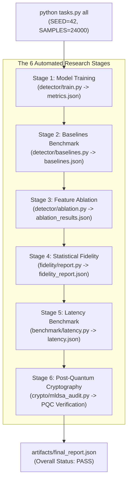

# LEARN_11: Pipelines and Artifacts

> **Prerequisites:** [LEARN_02](LEARN_02_TECH_STACK.md), [LEARN_06](LEARN_06_THE_ML_MODEL.md), [LEARN_08](LEARN_08_CRYPTO_AUDIT.md)  
> **You will be able to:**
> - Execute every target in `tasks.py` and `Makefile` from the command line.
> - Trace the six automated stages executed by the `ExperimentRunner`.
> - Know the location, schema, and generating module for all output artifacts.
> - Cite the exact verified benchmark metrics on disk with full provenance.  
> **Files this chapter is about:** `tasks.py`, `Makefile`, `backend/app/experiment_runner.py`, `artifacts/**`

---

## 1. Automated Task Runners (`tasks.py` & `Makefile`)

🧒 **Like you're five**  
Imagine you have a big toy train set that takes six steps to set up: lay the tracks, put on the engine, load the coal, test the whistle, check the lights, and print the train schedule. Instead of doing each job by hand, you have one big green button labeled `all` (`python tasks.py all`). You press it once, and the entire train set builds itself and prints a gold star report!

🏪 **In real life**  
In machine learning and security research, reproducibility is paramount. If training, baseline evaluation, feature ablation, latency benchmarking, and cryptographic tests require 15 disparate shell scripts with conflicting arguments, experiments drift and cannot be verified by external reviewers.

🎓 **Properly**  
The repository provides unified, twin task runners: `Makefile` for POSIX/Linux environments and `tasks.py` (`tasks.py:26`) for Windows and cross-platform environments. Each target shells out to identical underlying Python modules with standardized seed and sample arguments (`SEED=42`, `SAMPLES=24000`).

```
┌────────────────────────────────────────────────────────────────────────┐
│                        FORSETI PIPELINE TARGETS                        │
├─────────────┬──────────────────────────────────────────────────────────┤
│ Target      │ Action & Output                                          │
├─────────────┼──────────────────────────────────────────────────────────┤
│ `install`   │ `pip install -r backend/requirements.txt`                │
│ `train`     │ Trains detector -> `forseti_model.joblib`, `metrics.json`│
│ `evaluate`  │ Runs 5 baselines -> `artifacts/evaluation/baselines.json`│
│ `ablation`  │ Retrains 6 variants -> `evaluation/ablation_results.json`│
│ `fidelity`  │ Runs KS/JS/discriminator tests -> `fidelity_report.json` │
│ `benchmark` │ Measures 10,000 transactions -> `benchmark/latency.json` │
│ `pqc-test`  │ Verifies ML-DSA-44 post-quantum signing & 4 tamper tests │
│ `test`      │ Executes full 455-test pytest suite (`pytest tests/ -q`)  │
│ `demo`      │ Runs 8-phase automated console walkthrough               │
│ `all`       │ Full 6-stage pipeline -> `artifacts/final_report.json`   │
│ `anchors`   │ Inspects status of external PaySim/ULB anchor CSVs       │
│ `backend`   │ Starts FastAPI server on `:8000` via Uvicorn             │
│ `frontend`  │ Starts Next.js dev server on `:3005`                     │
└─────────────┴──────────────────────────────────────────────────────────┘
```

You can inspect all available targets from your terminal at any time:
```bash
python tasks.py list
```

---

## 2. The 6-Stage Experiment Runner (`experiment_runner.py`)

When you run `python tasks.py all`, `ExperimentRunner` (`backend/app/experiment_runner.py:45`) executes all six research stages sequentially and produces `artifacts/final_report.json`:



---

## 3. The Artifacts Catalog

Every experimental measurement claimed by FORSETI is saved to disk as a structured JSON artifact or headless Matplotlib PNG figure (`backend/app/paths.py`):

```
┌────────────────────────────────────────────────────────────────────────┐
│                        ARTIFACT REGISTRY TABLE                         │
├───────────────────────────────┬──────────────────────┬─────────────────┤
│ Artifact Path                 │ Written By           │ Served By       │
├───────────────────────────────┼──────────────────────┼─────────────────┤
│ `artifacts/models/`           │ `detector/train.py`  │ Loaded by       │
│ `forseti_model.joblib`        │                      │ `inference.py`  │
│ `feature_schema.json`         │                      │                 │
│ `forseti_xgb.json`            │                      │                 │
├───────────────────────────────┼──────────────────────┼─────────────────┤
│ `artifacts/evaluation/`       │ `detector/train.py`  │ `GET /metrics`  │
│ `metrics.json`                │                      │ `/evaluation`   │
│ `pr_curve.png`, `roc_curve.png`                      │                 │
│ `confusion_matrix.png`        │                      │                 │
├───────────────────────────────┼──────────────────────┼─────────────────┤
│ `artifacts/evaluation/`       │ `detector/           │ `GET /evaluation`│
│ `baselines.json`              │  baselines.py`       │                 │
├───────────────────────────────┼──────────────────────┼─────────────────┤
│ `artifacts/evaluation/`       │ `detector/           │ `GET /evaluation`│
│ `ablation_results.json`       │  ablation.py`        │                 │
├───────────────────────────────┼──────────────────────┼─────────────────┤
│ `artifacts/benchmark/`        │ `benchmark/          │ `GET /benchmark/│
│ `latency.json`                │  latency.py`         │  latency`       │
├───────────────────────────────┼──────────────────────┼─────────────────┤
│ `artifacts/fidelity/`         │ `fidelity/report.py` │ `GET /fidelity` │
│ `fidelity_report.json`        │                      │                 │
│ `fidelity_report.html`        │                      │                 │
├───────────────────────────────┼──────────────────────┼─────────────────┤
│ `artifacts/events/`           │ `arena/events.py`    │ `GET /recordings`│
│ `ARENA-*.jsonl`               │                      │ `/replay/{id}`  │
├───────────────────────────────┼──────────────────────┼─────────────────┤
│ `artifacts/final_report.json` │ `experiment_         │ `GET /report/   │
│                               │  runner.py`          │  final`         │
└───────────────────────────────┴──────────────────────┴─────────────────┘
```

---

## 4. Current Verified Measured Numbers

All numbers below were verified directly from disk artifacts generated on **2026-08-18** (`SEED=42`, `SAMPLES=24000`):

### A. Core Detection Performance (`metrics.json → test_metrics`)
- **PR-AUC:** **0.9209**
- **ROC-AUC:** **0.9766**
- **Precision:** 1.0000
- **Recall:** 0.4257
- **F1 Score:** **0.8772**
- **Recall @ 0.5% FPR:** **0.8226**
- **False Positive Rate (FPR):** 0.0000
- **Confusion Matrix:** True Negative $= 3,361$, False Positive $= 0$, False Negative $= 74$, True Positive $= 165$ (Total test samples $= 3,600$)
- **Financial Value Saved:** **₹3,49,956.57** (Legitimate spend blocked $= ₹0.00$)
- **Calibration (ECE):** Reduced from $0.01377 \to \mathbf{0.00611}$ via Isotonic Regression.

---

### B. Baseline Architecture Benchmark (`baselines.json`)

Evaluated on the identical 3,600-sample test slice under the **attack-family holdout** condition (`CROSS_RAIL_SPLIT` withheld from training):

| Architecture | Features | PR-AUC | Total Recall | Cross-Rail Recall | 95% CI (n=64) | False Positive Rate |
|---|---:|---:|---:|---:|---:|---:|
| Rules Only | 0 | 0.1262 | 0.4653 | **0.3906** | [0.281, 0.513] | 0.14332 |
| Per-Rail ML (Siloed) | 24 | 0.6534 | 0.4554 | **0.1719** | [0.099, 0.282] | 0.01179 |
| Global ML (No DTL) | 25 | 0.6580 | 0.4257 | **0.1719** | [0.099, 0.282] | 0.00965 |
| Hybrid ML + DTL | 37 | 0.9400 | 0.8564 | **0.8281** | [0.718, 0.901] | 0.00143 |
| Deterministic DTL Invariant | 3 | 0.2530 | 0.8614 | **0.8438** | [0.736, 0.913] | 0.15761 |

*With the attack family seen in training:* hybrid ML cross-rail recall is **0.8438** and the
invariant is **0.8438** again. Unchanged, because it has no fitted parameter that training data
can move.

**Two comparisons, only one of which the sample size supports.** The gap between a model with
the aggregate feature (0.8281) and one without (0.1719) is far wider than these intervals: real.
The gap between hybrid ML held-out (0.8281) and seen (0.8438) is 0.0157 and the intervals
overlap: **not** resolvable at n=64, so no generalisation claim is made from it. The invariant's
two columns are equal by construction rather than by measurement, which is the property that
does not depend on n.

---

### C. Feature Ablation Benchmark (`ablation_results.json`)

- **Variant A (All 29 Features):** PR-AUC **0.9400**
- **Variant B (No DTL Features, 17 Features):** PR-AUC **0.7261**
- **Variant C (No Semantic Features, 24 Features):** PR-AUC **0.9556**
- **Variant D (No Cross-Rail Features, 23 Features):** PR-AUC **0.9466**
- **Variant E (No Delegation Features, 23 Features):** PR-AUC **0.9597**
- **Variant F (Raw Features Only, 8 Features):** PR-AUC **0.6106**
- **Measured DTL Feature Lift (A vs. B):** **+0.2302 PR-AUC (+31.7% relative lift)**

---

### D. Inline Latency Benchmark (`latency.json`)

Measured over 10,000 continuous transactions:

```
┌────────────────────────────────────────────────────────────────────────┐
│                   INLINE LATENCY BENCHMARK BREAKDOWN                   │
├──────────────────────────────┬──────────┬──────────┬───────────────────┤
│ Pipeline Stage               │ p50 (ms) │ p95 (ms) │ p99 (ms)          │
├──────────────────────────────┼──────────┼──────────┼───────────────────┤
│ 1. Feature Extraction (29 f) │ 0.0311 ms│ 0.0451 ms│ 0.0558 ms         │
│ 2. DTL Invariant Evaluation  │ 0.0040 ms│ 0.0053 ms│ 0.0066 ms         │
│ 3. ML Model Inference        │ 0.4900 ms│ 0.6337 ms│ 0.8295 ms         │
├──────────────────────────────┼──────────┼──────────┼───────────────────┤
│ FULL END-TO-END PIPELINE     │ 0.5259 ms│ 0.6803 ms│ **0.8791 ms**     │
└──────────────────────────────┴──────────┴──────────┴───────────────────┘
```
- **SLA Verdict:** `PASS - measured p99 0.8791 ms < 30.0 ms budget` (`benchmark/latency.py:30`).

---

### E. Fidelity Report (`fidelity_report.json`)
- **Overall Status:** `NOT RUN / DATASET UNAVAILABLE` (Anchor datasets PaySim and ULB are proprietary and not redistributed).
- **Synthetic Internal Self-Test:** Internal KS statistic $= 0.0164$, Discriminator AUC $= 0.4826$ (Explicitly reported as a pipeline self-test, not external realism proof).

---

## Check yourself

1. **What command executes the entire 6-stage research pipeline from scratch?**
2. **What is the measured p99 end-to-end latency of the FORSETI defense pipeline?**
3. **What is the PR-AUC of the full hybrid model on the test dataset?**
4. **What is the cross-rail recall of learned ML models when the attack family is withheld?**
5. **Why does `fidelity_report.json` report `NOT RUN / DATASET UNAVAILABLE`?**

<details>
<summary>Answers</summary>

1. `python tasks.py all` (or `python tasks.py experiment`) (`tasks.py:45`).
2. **0.8791 ms**, comfortably passing the self-imposed 30.0 ms SLA budget (`artifacts/benchmark/latency.json`).
3. **0.9209** in `metrics.json` (and **0.9400** in the baseline test split `baselines.json`).
4. **0.0000 (0.0% recall)** across all learned architectures (`artifacts/evaluation/baselines.json`).
5. Because the public anchor datasets (PaySim and ULB Credit Card Fraud) are licensed and not redistributed in the repository (`docs/RESPONSIBLE_RESEARCH.md`).
</details>

---

## Where to go next
→ [LEARN_12. Tests and Verify](LEARN_12_TESTS_AND_VERIFY.md)
